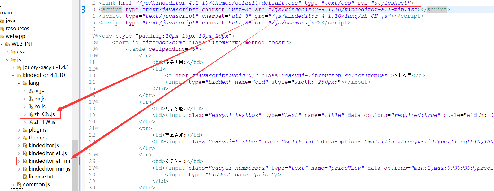
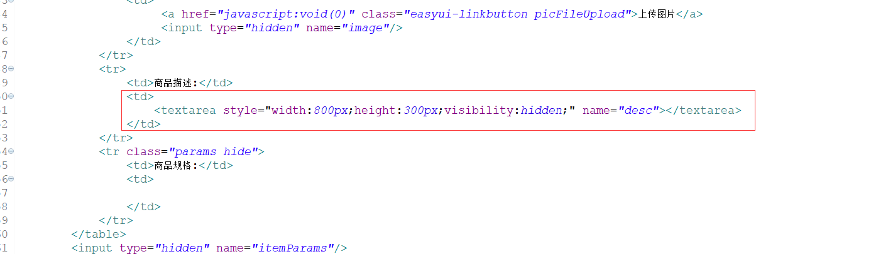
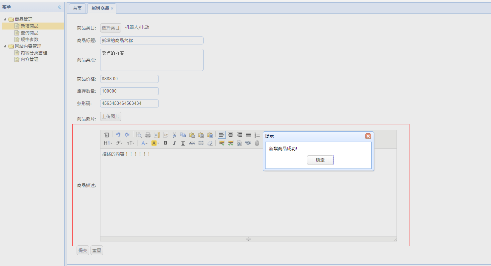

# 富文本编辑器

富文本编辑器是一种可内嵌于浏览器，所见即所得的文本编辑器。这里用的富文本编辑器是KindEditor。

## 1.搭建富文本编辑器     

1. 在项目中添加富文本编辑器js文件，jsp文件添加引用     

      

   引入文本框插件，引入提示语言     

   _要用KindEditor插件，就得引入该js_    

2. 添加textarea   

      

   textarea设置为不可见   

   这里显示的是KindEditor的编辑器，而textarea是用来同步KindEditor编辑器的内容，以做提交。     

3. jq初始化KindEditor控件    

   - 显示的页面：

     ```javascript
     	$(function(){
     		//创建富文本编辑器
     		itemAddEditor = TAOTAO.createEditor("#itemAddForm [name=desc]");
     		//初始化类目选择和图片上传器
     		TAOTAO.init({fun:function(node){
     			//根据商品的分类id取商品 的规格模板，生成规格信息。第四天内容。
     			//TAOTAO.changeItemParam(node, "itemAddForm");
     		}});
     	});
     ```

   - 引入的common.js  

     ```javascript
         createEditor : function(select){
         	return KindEditor.create(select, TT.kingEditorParams);
         },
     ```

     ​	配置编辑器参数   

     ```javascript
     var TT = TAOTAO = {
     	// 编辑器参数
     	kingEditorParams : {
     		//指定上传文件参数名称
     		filePostName  : "uploadFile",
     		//指定上传文件请求的url。
     		uploadJson : '/pic/upload',
     		//上传类型，分别为image、flash、media、file
     		dir : "image"
     	},
       ...
     ```

     ​	提交表单    

     ```javascript
     //提交表单
     	function submitForm(){
     		//有效性验证
     		if(!$('#itemAddForm').form('validate')){
     			$.messager.alert('提示','表单还未填写完成!');
     			return ;
     		}
     		//取商品价格，单位为“分”
     		$("#itemAddForm [name=price]").val(eval($("#itemAddForm [name=priceView]").val()) * 100);
     		//同步文本框中的商品描述
     		itemAddEditor.sync();
     ```

     ...

     ```javascript
     		$.post("/item/save",$("#itemAddForm").serialize(), function(data){   //序列化表单内容
     			if(data.status == 200){
     				$.messager.alert('提示','新增商品成功!');
     			}
     		});
     	}
     ```

     1. 点击提交按钮执行的操作，校验内容有没有填完整，然后把KindEditor的内容同步到隐藏的textarea中，提交到save方法。   
     2. 根据后台的状态码判断提交的状态，200则输出成功。 

## 2.后台接收   

### 1.定义响应状态    

定义相应结构的作用是对返回的信息进行处理，例如输出状态码等。将其放在pojo包下面，以便调用。

响应工具主要有以下信息：

```
    // 响应业务状态
    private Integer status;

    // 响应消息
    private String msg;

    // 响应中的数据
    private Object data;
```

_前端在提交数据之后需要知道提示什么信息，状态怎么样，这些都由响应工具实现。需要什么信息根据前端插件来定。_    

【[响应POJO](../Tools/TaotaoResult.java)】，该工具不做具体介绍。   

### 2.编写Service接口和实现方法   

```java
	@Override
	public TaotaoResult createItem(TbItem item) {
	//item补全   
		//生成商品id
		Long itemId = IDUtils.genItemId();
		item.setId(itemId);
		//商品状态     1-正常  2-下架   3-删除
		item.setStatus((byte)1);
		item.setCreated(new Date());
		item.setUpdated(new Date());
		//插入到数据库
		itemMapper.insert(item);
		return TaotaoResult.ok();
	}
```

返回的类型为定义状态的pojo，（IDUtils类工具可参考文章6）itemMapper的insert方法是是用逆向工程生成的insert方法。（可查看文章2）   

_这里将前端的信息存储进item中，而那些没有的信息需要后台进行补充。像id，创建修改日期，状态等_    

### 3.编写Controller方法   

```java
	@RequestMapping(value="/item/save",method=RequestMethod.POST)
	@ResponseBody
	private TaotaoResult createItem(TbItem item) {
		return itemService.createItem(item);
	}
```

接收url方法，并且指定为POST请求。

  
