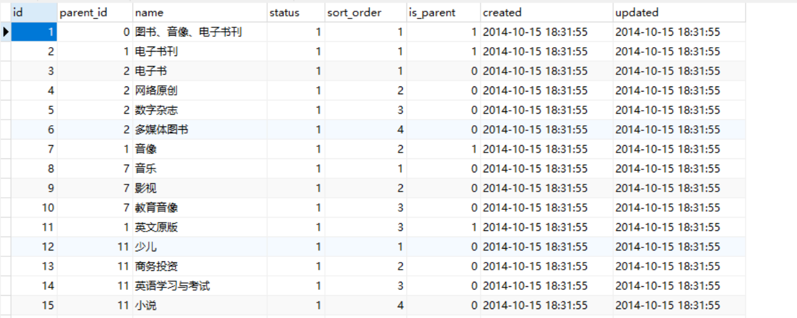
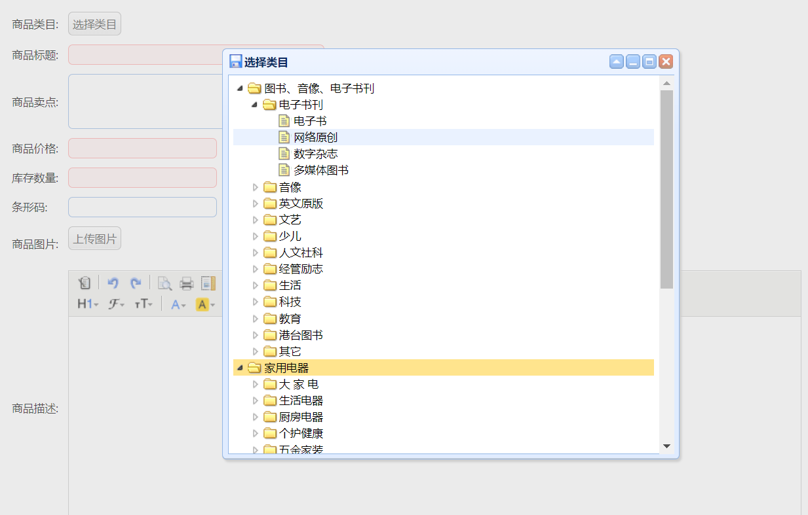

# easyUI tree插件   

easyUI tree插件的可以将已经有树结构的数据展示出来。树结构的数据就是在同一个表中，A数据的id是B数据的外键，以此表示A节点的下一级节点为B。    

    

如上图，parent_id每个数字代表其父节点的id（0代表没有父节点）    

例如 id ：1 - 10 用树表示则是：

```
		图书、音像、电子书刊
				|__	电子书刊
				|	  |__电子书
				|	  |__网络原创
				|	  |__数字杂志
				|	  |__多媒体图书
				|__音像
					  |__音乐
					  |__影视					  
					  |__教育音像			
                      ...
```

而最后一个节点的is_parent就为0。	

## 1.easyUI tree使用条件 

1. 拥有树结构的表数据    
2. 引入了easyUI的js    
3. 使用逆向工程生成了代码

## 2.分析easyUI tree使用所需的数据    

1. 作为一棵数据树，他接收的数据类型为json格式    

2. 异步树所需的数据结构：**id**  ,  节点上的文字：**text**  ,  节点的当前状态：**status**       

   【异步树】：当点击节点的时候，才从数据库中加载子节点。（而不是事先预载好）   

所需的数据使用一个pojo包装起来，进行返回。    

## 3.easyUI tree前端的使用   

1. 触发按钮   

   ```html
   <a href="javascript:void(0)" class="easyui-linkbutton selectItemCat">选择类目</a>
   ```

2. 触发事件    

   因为easyUI tree的初始化多个地方会用到，所以一般写在一个通用的common.js里面，一旦要用到就直接引入该js文件。    

   初始化方法：

   ```javascript
       init : function(data){
       	// 初始化图片上传组件
       	this.initPicUpload(data);
       	// 初始化选择类目组件
       	this.initItemCat(data);
       },
   ```

   渲染插件： 

   ```javascript
       // 初始化选择类目组件
       initItemCat : function(data){
       	$(".selectItemCat").each(function(i,e){
       		var _ele = $(e);
       		if(data && data.cid){
       			_ele.after("<span style='margin-left:10px;'>"+data.cid+"</span>");
       		}else{
       			_ele.after("<span style='margin-left:10px;'></span>");
       		}
       		_ele.unbind('click').click(function(){
       			$("<div>").css({padding:"5px"}).html("<ul>")
       			.window({
       				width:'500',
       			    height:"450",
       			    modal:true,
       			    closed:true,
       			    iconCls:'icon-save',
       			    title:'选择类目',
       			    onOpen : function(){
       			    	var _win = this;
       			    	$("ul",_win).tree({
       			    		url:'/item/cat/list',
       			    		animate:true,
       			    		onClick : function(node){
       			    			if($(this).tree("isLeaf",node.target)){
       			    				// 填写到cid中
       			    				_ele.parent().find("[name=cid]").val(node.id);
       			    				_ele.next().text(node.text).attr("cid",node.id);
       			    				$(_win).window('close');
       			    				if(data && data.fun){
       			    					data.fun.call(this,node);
       			    				}
       			    			}
       			    		}
       			    	});
       			    },
       			    onClose : function(){
       			    	$(this).window("destroy");
       			    }
       			}).window('open');
       		});
       	});
       },
   ```

   1. 编写请求树数据的url     
   2. 每点击一次执行一次onClick请求，请求的时候会把当前节点的id传到url中。用返回的数据对节点进行判断，是否是叶子节点，并选择它的显示方式。   

   _tree插件只要你告诉 它请求树数据的url地址。在页面加载的时候它就会自己渲染出一个空树壳出来，你一点击一个节点，他就拿着当前这个节点跑去url里面拿数据。拿到数据之后他对数据做一系列的处理，然后显示出来。_    

## 4.easyUI tree的数据请求    

### 1.构建返回的POJO对象    

因为插件需要的是固定格式的json数据，所以用对象包装属性后放进List中进行返回。     

构建json的位置为common工程（第四专题有提到，common工程相当于一个工具箱）。      

```java
/**
 * EasyUI树形控件节点
 * @author liyb
 *
 */
public class EUTreeNode {
	private long id;
	private String text;
	private String state;
	public long getId() {
		return id;
	}
...
}
```

根据所需数据创建的pojo    

### 2.编写Service接口和接口实现    

1. 接口定义

   ```java
   public interface ItemCatService {
   	List<EUTreeNode> getCatList(long parentId);
   }
   ```

2. 接口实现

   ```java
   /**
    * 商品分类管理  
    * @author liyb
    *
    */
   @Service
   public class ItemCatServiceImpl implements ItemCatService {
   	@Autowired
   	private TbItemCatMapper itemCatMapper;
   	@Override
   	public List<EUTreeNode> getCatList(long parentId) {
   		//创建查询条件
   		TbItemCatExample example = new TbItemCatExample();
   		Criteria criteria = example.createCriteria();
   		criteria.andParentIdEqualTo(parentId);
   		//根据条件查询   
   		List<TbItemCat> list = itemCatMapper.selectByExample(example);
   		List<EUTreeNode> resultList = new ArrayList<>();
   		//把列表转化为treeNodeList   
   		for(TbItemCat tbItemCat : list){
   			EUTreeNode node = new EUTreeNode();
   			node.setId(tbItemCat.getId());
   			node.setText(tbItemCat.getName());
   			node.setState(tbItemCat.getIsParent()?"closed":"open");
   			resultList.add(node);
   		}
   		//返回结果
   		return resultList;
   	}
   }
   ```

   1. example用于添加条件，相当where后面的部分，其通过添加id限定为查询指定id的数据。

      ```java
      		//创建查询条件
      		TbItemCatExample example = new TbItemCatExample();
      		Criteria criteria = example.createCriteria();
      		criteria.andParentIdEqualTo(parentId);
      ```

      （更多逆向工程的条件限定可进行百度搜索）   

   2. 查询到指定的数据之后，存进对象里，再将对象存进List中    

      ```java
      			EUTreeNode node = new EUTreeNode();
      			node.setId(tbItemCat.getId());
      			node.setText(tbItemCat.getName());
      			node.setState(tbItemCat.getIsParent()?"closed":"open");
      			resultList.add(node);
      ```

（Service详细介绍见第二专题）

### 3.Controler请求    

```java
/**
 * 商品分类管理Controller
 * @author liyb
 *
 */
@Controller
@RequestMapping("/item/cat")
public class ItemCatController {
	@Autowired
	private ItemCatService itemCatService;
	@RequestMapping("/list")
	@ResponseBody
	private List<EUTreeNode> getCatList(@RequestParam(value="id",defaultValue="0")long parentId){
		List<EUTreeNode> list = itemCatService.getCatList(parentId);
		return list;
	}
}
```

获取传来的id值，如果每传过来就默认为0。

### 4.运行   

对common工程进行install之后就可以运行项目了。（详情可见专题四）

   