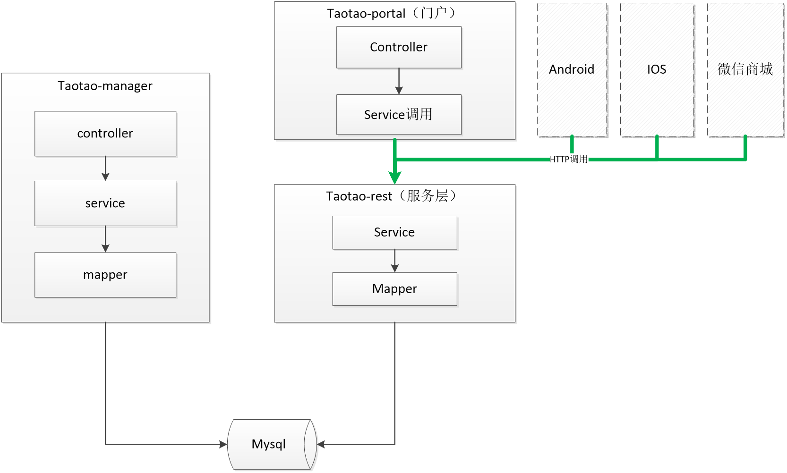

# 前后端分离      

本文主要介绍前台和后台分离的方式，将服务层抽取出来，各自搭建一个工程，可以减低耦合度，灵活地进行分布式部署。而由于是不同的工程，服务之间通过接口通信，开发工作量提高。   

  

M:怎么灵活地分布式部署？

Z:例如服务层被访问的压力比较大，就可以多部署几台服务器,处理高并发问题。

这里使用两个项目来搭建前台，分别是服务层 & 表现层。   

## 1.创建后端工程(服务层)   

D:创建服务层taotao-rest

M:服务层会用到哪些技术呢？

Z:使用到的技术：

​	Mybatis连接数据库,

​	Spring,

​	SpringMVC发布服务

### 1.pom添加依赖   

D：直接依赖mapper整个模块，把相关的jar包都继承过来。

1. 继承mapper

```xml
  <dependencies>
  	<dependency>
  		<groupId>com.taotao</groupId>
  		<artifactId>taotao-manager-mapper</artifactId>
  		<version>0.0.1-SNAPSHOT</version>
  	</dependency>
  </dependencies>
```

M:这样依赖有什么好处？

Z:除了mapper自身，它上层的pojo，common由于都要用到，它们的jar包都被依赖过来。

M:这样的话，mapper就相当于service模块的位置。模块化的好处估计就在这里，直接在中间就可以依赖过来。

D：用到spring的东西，依赖过来    

```xml
  		<!-- Spring -->
	<dependency>
		<groupId>org.springframework</groupId>
		<artifactId>spring-context</artifactId>
		<version>${spring.version}</version>
	</dependency>
	<dependency>
		<groupId>org.springframework</groupId>
		<artifactId>spring-beans</artifactId>
		<version>${spring.version}</version>
	</dependency>
	<dependency>
		<groupId>org.springframework</groupId>
		<artifactId>spring-webmvc</artifactId>
		<version>${spring.version}</version>
	</dependency>
	<dependency>
		<groupId>org.springframework</groupId>
		<artifactId>spring-jdbc</artifactId>
		<version>${spring.version}</version>
	</dependency>
	<dependency>
		<groupId>org.springframework</groupId>
		<artifactId>spring-aspects</artifactId>
		<version>${spring.version}</version>
	</dependency>
```

D:controller层，虽然不用表现层，当时servlet的东西可能会用到，加进来   

```xml
	<dependency>
		<groupId>javax.servlet</groupId>
		<artifactId>servlet-api</artifactId>
		<version>${servlet-api.version}</version>
		<scope>provided</scope>
	</dependency>
	<dependency>
		<groupId>javax.servlet</groupId>
		<artifactId>jsp-api</artifactId>
		<version>${jsp-api.version}</version>
		<scope>provided</scope>
	</dependency>
```

### 2.添加web.xml    

D:war包下需要有一个web.xml,创建了才不会报错。

```xml
<?xml version="1.0" encoding="UTF-8"?>
<web-app xmlns:xsi="http://www.w3.org/2001/XMLSchema-instance"
	xmlns="http://java.sun.com/xml/ns/javaee" xmlns:web="http://java.sun.com/xml/ns/javaee/web-app_2_5.xsd"
	xsi:schemaLocation="http://java.sun.com/xml/ns/javaee http://java.sun.com/xml/ns/javaee/web-app_2_5.xsd"
	id="kcat" version="2.5">
	<display-name>kcat-rest</display-name>
	<!-- 加载spring容器 -->
	<context-param>
		<param-name>contextConfigLocation</param-name>
		<param-value>classpath:spring/applicationContext-*.xml</param-value>
	</context-param>
	<listener>
		<listener-class>org.springframework.web.context.ContextLoaderListener</listener-class>
	</listener>
	<!-- 解决post乱码 -->
	<filter>
		<filter-name>CharacterEncodingFilter</filter-name>
		<filter-class>org.springframework.web.filter.CharacterEncodingFilter</filter-class>
		<init-param>
			<param-name>encoding</param-name>
			<param-value>utf-8</param-value>
		</init-param>
	</filter>
	<!-- springmvc的前端控制器 -->
	<servlet>
		<servlet-name>kcat-rest</servlet-name>
		<servlet-class>org.springframework.web.servlet.DispatcherServlet</servlet-class>
		<!-- contextConfigLocation不是必须的， 如果不配置contextConfigLocation， springmvc的配置文件默认在：WEB-INF/servlet的name+"-servlet.xml" -->
		<init-param>
			<param-name>contextConfigLocation</param-name>
			<param-value>classpath:spring/springmvc.xml</param-value>
		</init-param>
		<load-on-startup>1</load-on-startup>
	</servlet>
	<servlet-mapping>
		<servlet-name>kcat-rest</servlet-name>
		<url-pattern>/rest/*</url-pattern>
	</servlet-mapping>
</web-app>
```

M:spring容器用到，解决乱码也需要，发布服务用到前端控制器，而扫描器指定 /rest/* 路径下的访问被拦截。

### 3.框架整合

M：什么是框架整合？

Z：就是将其他框架弄在一起

例如添加resources ：

  

db.properties用来连接数据库，无需修改

resource.properties资源文件配置无需用到，可清空

applicationContext-dao.xml,也是扫描cn.taotao.mapper下的文件，无需修改

```xml
	<!-- 配置扫描包，加载mapper代理对象 -->
	<bean class="org.mybatis.spring.mapper.MapperScannerConfigurer">
		<property name="basePackage" value="cn.kcat.mapper"></property>
	</bean>
```

applicationContext-service.xml，扫描的包需要进行修改（包新建后才不会报错）

```xml
	<!-- 扫描包加载Service实现类 -->
	<context:component-scan base-package="cn.kcat.rest.service"></context:component-scan>
```

applicationContext-trans.xml 修改事务的切面

```xml
	<!-- 切面 -->
	<aop:config>
		<aop:advisor advice-ref="txAdvice"
			pointcut="execution(* cn.kcat.rest.service.*.*(..))" />
	</aop:config>
```

springmvc.xml修改扫描,资源映射不需要配，因为拦截只对单个/有效，对/rest/*无效

```xml
	<context:component-scan base-package="cn.kcat.rest.controller" />
	<mvc:annotation-driven />
```

### 4.配置tomcat

D:启动需要配置tomcat 

1. 使用不同的端口号：8081    

### 5.静态资源的位置

M：静态资源放在哪里呢？

Z：webapp下，WEB-INF同层

 

M：为什么css之类的静态资源要放在外面而不放在WEB-INF里面？

Z：因为放在WEB-INF里面的html是直接访问不了的，就是为了安全着想。而静态资源放在里面就会访问不了，就需要配映射，一旦配了映射。WEB-INF就是去了原来的安全性。

## 2.创建前端工程(表现层)

D:继承于parent工程，所有工程的母工程

M:为什么要继承parent？

Z:parent定义了所有jar包的版本号，我们所有新建的子工程都要继承于parent工程

M:门户系统需要到哪些技术？

Z:Spring , SpringMVC , JSTL ，HttpClient等，由于不用连接数据库，而是通过调用服务的方式，所以不需要Mybatis    

Z:表现层和服务端之间没有直接依赖关系，完全独立，所以不需要依赖哪个工程。（不是继承）

### 1.pom添加依赖

Z：虽然不需要依赖其他项目，但是还是需要spring的，把spring相关的拷进来

因为是前端JSP相关的也要依赖进来

```xml
  		<!-- Spring -->
	<dependency>
		<groupId>org.springframework</groupId>
		<artifactId>spring-context</artifactId>
		<version>${spring.version}</version>
	</dependency>
	<dependency>
		<groupId>org.springframework</groupId>
		<artifactId>spring-beans</artifactId>
		<version>${spring.version}</version>
	</dependency>
	<dependency>
		<groupId>org.springframework</groupId>
		<artifactId>spring-webmvc</artifactId>
		<version>${spring.version}</version>
	</dependency>
	<dependency>
		<groupId>org.springframework</groupId>
		<artifactId>spring-jdbc</artifactId>
		<version>${spring.version}</version>
	</dependency>
	<dependency>
		<groupId>org.springframework</groupId>
		<artifactId>spring-aspects</artifactId>
		<version>${spring.version}</version>
	</dependency>
	<!-- JSP相关 -->
	<dependency>
		<groupId>jstl</groupId>
		<artifactId>jstl</artifactId>
		<version>${jstl.version}</version>
	</dependency>
	<dependency>
		<groupId>javax.servlet</groupId>
		<artifactId>servlet-api</artifactId>
		<version>${servlet-api.version}</version>
		<scope>provided</scope>
	</dependency>
	<dependency>
		<groupId>javax.servlet</groupId>
		<artifactId>jsp-api</artifactId>
		<version>${jsp-api.version}</version>
		<scope>provided</scope>
	</dependency>
```

Z:依赖taotao-common

```xml
	<dependency>
		<groupId>cn.kemao666</groupId>
		<artifactId>kemao-common</artifactId>
		<version>0.0.1-SNAPSHOT</version>
	</dependency>
```

M:为什么要依赖taotao-common项目

Z:因为用到HttpClient工具，而common项目里面的工具我们很多都会用到，所以相当于把工具类依赖过来。

### 2.添加web.xml

M:spring容器需要添加

```xml
	<!-- 加载spring容器 -->
	<context-param>
		<param-name>contextConfigLocation</param-name>
		<param-value>classpath:spring/applicationContext-*.xml</param-value>
	</context-param>
	<listener>
		<listener-class>org.springframework.web.context.ContextLoaderListener</listener-class>
	</listener>
```

乱码处理前端需要到

```xml
	<!-- 解决post乱码 -->
	<filter>
		<filter-name>CharacterEncodingFilter</filter-name>
		<filter-class>org.springframework.web.filter.CharacterEncodingFilter</filter-class>
		<init-param>
			<param-name>encoding</param-name>
			<param-value>utf-8</param-value>
		</init-param>
	</filter>
```

服务请求需要到前端控制器

```xml
	<!-- springmvc的前端控制器 -->
	<servlet>
		<servlet-name>kcat-portal</servlet-name>
		<servlet-class>org.springframework.web.servlet.DispatcherServlet</servlet-class>
		<!-- contextConfigLocation不是必须的， 如果不配置contextConfigLocation， springmvc的配置文件默认在：WEB-INF/servlet的name+"-servlet.xml" -->
		<init-param>
			<param-name>contextConfigLocation</param-name>
			<param-value>classpath:spring/springmvc.xml</param-value>
		</init-param>
		<load-on-startup>1</load-on-startup>
	</servlet>
```

拦截*.html的内容，实现伪静态化

```xml
	<servlet-mapping>
		<servlet-name>kcat-portal</servlet-name>
		<!-- 伪静态化 -->
		<url-pattern>*.html</url-pattern>
	</servlet-mapping>
```

### 3.框架整合

Z:applicationContext-dao.xml，除了加载配置文件有用，其他用不到，整合到service中。service还要指定扫描包

```xml
	<!-- 加载配置文件 -->
	<context:property-placeholder location="classpath:resource/*.properties" />
	
	<!-- 扫描包加载Service实现类 -->
	<context:component-scan base-package="cn.kcat.portal.service"></context:component-scan>
```

事务不需要到，删除

springmvc.xml需要扫描包和视图解析器，资源映射只用于单个/ , 这里就不用了

```xml
	<context:component-scan base-package="cn.kcat.portal.controller" />
	<mvc:annotation-driven />  <!-- 注解驱动 -->
	<bean
		class="org.springframework.web.servlet.view.InternalResourceViewResolver">
		<property name="prefix" value="/WEB-INF/jsp/" />
		<property name="suffix" value=".jsp" />
	</bean>
```

文件位置如下：

   


Z：既然做了*.html拦截，为什么直接tomcat本地地址就可以访问

M：因为web.xml里面配置了访问首页index.html


### 5.跨域问题   

js不能进行跨域请求，js设计时为了安全考虑。域名相同，端口相同才不算跨域。

可以使用jsonp解决跨域问题。js跨域请求数据不行，js请求js脚本可以。   

将json数据变成js语句（在json前面添加category.getDateService(...)），然后追加到请求中。    

## 3.查询数据   

### 1.新建pojo   

D:

```java
public class CatNode {
	
	@JsonProperty("n")
	private String name;
	@JsonProperty("u")
	private String url;
	@JsonProperty("i")
	private List<?> item;

	public String getName() {
      ...
```

M:@JsonProperty("i")在这里的作用是什么？

Z:@JsonProperty 此注解用于属性上，作用是把该属性的名称序列化为另外一个名称，如把trueName属性序列化为name，@JsonProperty(value="name")。   

M:也就是说它就是用来说明json的key部分内容。

D:还有一个pojo

```java
public class CatResult {
	private List<?> data;
  ...
```

M:这个POJO用来干嘛？

Z:因为json的 n，u，i外层还包了一个data

### 2.编写Service   

D:

```java
public interface ItemCatService {
	CatResult getItemCatList();
}
```

```java
	@Override
	public CatResult getItemCatList() {
		CatResult catResult = new CatResult();
		//查询分类列表
		catResult.setData(getCatList(0));
		return catResult;
	}
```

```java
	private List<?> getCatList(long parentId){
		//创建查询条件
		TbItemCatExample example = new TbItemCatExample();
		Criteria criteria = example.createCriteria();
		criteria.andParentIdEqualTo(parentId);
		List<TbItemCat> list = itemCatMapper.selectByExample(example);
		//返回值list
		List resultList = new ArrayList<>();
		int count = 0;
		for (TbItemCat tbItemCat : list) {
			//判断是否为叶子节点
			if(tbItemCat.getIsParent()){
				CatNode catNode = new CatNode();
				if(parentId == 0){    //第一层
					catNode.setName("<a href='/products/"+tbItemCat.getId()+".html'>"+tbItemCat.getName()+"</a>");
				}else{
					catNode.setName(tbItemCat.getName());
				}
				catNode.setUrl("/products/"+tbItemCat.getId()+".html");
				catNode.setItem(getCatList(tbItemCat.getId()));
				resultList.add(catNode);
				count ++;
				//第一级只取11条
				if(parentId == 0 && count >= 14){
					break;
				}
			}else{
				resultList.add("/products/"+tbItemCat.getId()+".html|"+tbItemCat.getName());
			}
		}
		return resultList;
	}
```

M:最后一个方法parentId是什么？

Z:parentId是该类别的等级，它传进去0说明获取第一等级的数据。

M:那  ``if(tbItemCat.getIsParent()){`` 的作用是什么？

Z:getIsParent()是tbItemCat的一个方法，这主要是由于tbItemCat表中有该属性。它的类型为tinyint，在 MySql 中还没有严格的 bool 类型，但使用 TINYINT(1) 隐式用作 bool 类型，零作为false，而非零值（包括负数）作为true。   

M:那这里就是做出了区分，如果没有子类，就直接显示名字（最大的类目，下图A）。有子类的话...CatNode是干嘛用的？

Z:CatNode是一个专门为json格式创建的pojo对象。它的属性主要有以下三个：

```java
	@JsonProperty("n")
	private String name;
	@JsonProperty("u")
	private String url;
	@JsonProperty("i")
	private List<?> item;
```

M:为什么setName有分两种

Z:parentId为0说明还有子类目，则使用带a标签(中大的类目，下图B)，否则直接显示文字（具体的类目C）。

M: ``if(parentId == 0 && count >= 14){``  的作用是什么？

Z:对第一级数目限制在14个以内。为了详细说明三种分类，图片如下：

  

M:``					catNode.setName("<a href='/products/"+tbItemCat.getId()+".html'>"+tbItemCat.getName()+"</a>");``  下面已经setUrl，为什么在name中还要添加< a >标签。    

Z:这个可能得等跳转功能实现之后再说了。

D:这里的前后端分离只要在于Controller的传输：

```java
	@RequestMapping(value="/itemcat/list")
	@ResponseBody
	public Object getItemCatList(String callback){
		CatResult catResult = itemCatService.getItemCatList();
		MappingJacksonValue mappingJacksonValue = new MappingJacksonValue(catResult);
		mappingJacksonValue.setJsonpFunction(callback);
		return mappingJacksonValue;
	}
```

M:这里的CatResult是什么？

Z:CatResult就只是一个List，因为json数据的格式需要所以创建的pojo。

M:  ``MappingJacksonValue mappingJacksonValue = new MappingJacksonValue(catResult);``  作用是什么？

Z:  针对显式注解 @ResponseBody 的方法 (我们本来就是直接响应JSON的)，而由于跨域问题，需要使用 MappingJacksonValue 进行封装处理。   

M: 这里就是将获取到的List数据作为json封装进一个方法里。     ``mappingJacksonValue.setJsonpFunction(callback);``  作用又是什么？

Z:  callback的内容是  category.getDataService。而在js调用里面就有对应的category.getDataService方法。    

M: 那也就是说，调用  /itemcat/list 的方法之后，他就会把  数据 + 调用方法名  一起包装成一个 Object 方法返回。而前端拿到Object方法之后，就会找到该调用方法名，把数据拿进去处理，进行显示。由于前端处理那一部分写得比较乱，就不麻烦两位前辈了。目前实现了如下效果的目录显示：

          