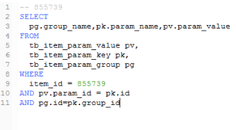

# 项目日志  

### 1.环境搭建  

1. 替换掉本地仓库.m2  
2. 创建parent的maven父工程   

不用模板，组织id为com.taotao  

Artifact id:    taotao-parent  

父工程为pom工程，不用继承于谁    

3. 配置pom文件的版本信息 

集中配置版本号，管理积累的jar包  

4. 创建用来管理通用工具的common工程  

还要继承父工程，同一个组，修改其pom，jar包从parent中找（版本号就不需要定义了）    

5. 新建manager聚合pom工程，继承于parent  

修改pom文件，依赖于common  

在里面把pojo（jar），mapper，service，controller（war）聚合在一起   

6. 创建四个模块  

创建模块的方式：在聚合工程上新建maven module   

pojo不依赖任何jar包  

mapper配置需要的依赖  

service设置依赖

web（controller）使用的是war，设置依赖，因为结构不完整，所以会报错  

（需要在src/main/webapp下创建WEB-INF/web.xml）  

7. 运行测试  

运行的对象是manager聚合工程，需要用到tomcat插件。所以要在manager的pom文件中配置tomcat插件  

运行maven需要使用命令clean tomcat7:run

（注意：要把taotao-parent&common安装到本地仓库）  

---

### 2.使用svn  

1. 新建仓库，选择创建简单的仓库结构  
2. 开发过程一般在主干中开发，定板之后小修改才在分支上开发  
3. 在eclipse中team-share-svn（leekoko6lyb）   

选择文件上传到trunk上

4. 选择要提交的内容进行提交

把setting和.project   .classpath   target忽略掉 

因为一些文件服务器不存在，所以不能忽略，需要先提交一部分才可以忽略  

5. 冲突：因为本地和服务器上传后会冲突，所以需要右键进行更新再提交  
6. 可以从svn导入maven工程，在从存在的maven project导入manager项目，manager项目可以转化为maven项目  

---

### 3.创建数据库      

#### 1.逆向工程    

导进逆向工程，配置数据库信息，根据数据库指定生成po类/接口/映射文件的位置，放在哪个包，指定哪个表（再次生成需要先删掉旧代码）  

将生成的mapper/pojo代码考到mapper/pojo的src/main/java下  

---

### 4.SSM的整合    

1. Dao层：使用mybatis框架，创建SqlMapConfig.xml   
2. Spring配置：创建applicationContext-dao.xml  
   - 配置数据源(db.properties),数据库连接池  
   - 让Spring管理SqlsessionFactory中，单例存在   
   - 把mapper代理对象放spring容器中，扫描包加载mapper代理对象    
3. Service配置
   - 事务管理  
   - 把service实现对象spring容器管理  
4. 表现层   
   - 三大组件：配置注解驱动  
   - 配置试图解析器  
   - 扫描controller  
5. Web.xml  
   - spring容器的配置  
   - springMVC前端控制器的配置  
   - post乱码过滤器  
6. 框架的整合需要把配置文件放在web下，因为它是war类型，tomcat只支持从war包读取文件（mybatis才可以从jar包中读取配置文件）    
   - 根据技术架构在src/main/resources中新建文件夹Folder：mybatis,resource,spring  
   - 往之间各自添加配置文件   
7. 在spring中添加applicationContext-service.xml文件，编写service包扫描    

在service中添加com.taotao.service,

8. 在spring中添加applicationContext-trans.xml文件  

指定事务管理器，数据源    

指定方法开头规则，是否需要开启新的事务（REQUIRED/SUPPORTS）   

配置切面，指定的拦截对象     

9. 表现层：在spring中配置springmvc.xml   

扫描controller，配置视图解析器   

做资源映射来处理静态资源被拦截的问题  

10. web.xm配置spring容器，前端控制器，post乱码过滤器   
11. 父容器不能访问子容器，反过来可以

子：springmvc--controller

父：spring--service，dao  

---

### 5.整合测试  

#### 1.在service中编写接口  

```java
public interface ItemService {
	TbItem getItemById(long itemId); 	
}
```

#### 2.编写接口实现  

```java
@Service
public class ItemServiceImpl implements ItemService{
```

将接口的代理对象注入进来   

```java
	@Autowired
	private TbItemMapper itemMapper;
```

实现接口的方法:

```java
	@Override
	public TbItem getItemById(long itemId) {
```

spring的applicationContext-service.xml添加service扫描:

``<context:component-scan base-package="com.taotao.service"></context:component-scan>``  

#### 3.新建Controller方法  

```java
@Controller
public class ItemController {
	@Autowired
	private ItemService itemService;
	
	@RequestMapping("/item/{itemId}")
	@ResponseBody
	public TbItem getItemById(@PathVariable Long itemId){     //从路径中取参数
		TbItem tbItem=itemService.getItemById(itemId);
		return tbItem;
	}	
	
}
```

注解controller,将Service注入   

做映射跳转@RequestMapping("/item/{itemId}"),获取itemId,注解返回json对象(@PathVariable Long itemId表示从路径中取参数,itemId应该与上面的值相同)   

这里还需要在springmvc.xml中配置扫描controller``	<context:component-scan base-package="com.taotao.controller" />` ``  

为了防止mybatis的mapper.xml文件不会被漏掉,需要在web的pom中添加:

```xml
	<!-- 如果不添加此节点mybatis的mapper.xml文件都会被漏掉。 -->
	<build>
		<resources>
            <resource>
                <directory>src/main/java</directory>
                <includes>
                    <include>**/*.properties</include>
                    <include>**/*.xml</include>
                </includes>
                <filtering>false</filtering>
            </resource>
        </resources>
	</build>
```

运行http://localhost:8080/item/830972即可测试获取数据   

#### 4.遇到的问题  

这里要求运行在jdk环境,我原本用的是jre.但是由于eclipse是32位的,所以我还需要配合使用32位的jdk.(还需在window环境和eclipse中配置:java-Installed JREs)     

#### 5.使用tomcat插件DeBug遇到的问题    

没有源码,需要把默认的remove掉,添加java Project:选择四个模块重启即可  

---

### 6.商品列表的查询  

#### 1.做页面跳转  

1. 配置首页跳转  

   ```java
   	@RequestMapping("/")
   	public String showIndex() {
   		return "index";
   	}
   ```

   返回逻辑视图--配了视图解析器(在springmvc.xml中配置)  

   视图解析器只要返回字符串,它就会自动拼成路径  

2. 配置其他页面跳转  

其他页面的前台跳转  

``<li data-options="attributes:{'url':'item-add'}">新增商品</li>``传的刚好是页面的名称  

```java
	@RequestMapping("/{page}")
	public String showpage(@PathVariable String page) {
		return page;
	}
```

通过controller获取传来的值,将其跳转到同名的路径上.  

#### 2.做商品展示测试  

1. easyUI通过 data-options 向后台请求数据,请求的时候还会默认带上page和rows两个参数.  

2. 编写顺序:mapper--Dao--Service--Controller  

3. 不想重写mapper,所以使用分页插件pageHeader  

   分页插件的原理就是在执行sql语句之前,通过拦截器添加limit限制  

4. 使用方式,引入jar包(增加依赖pom文件),在mybatis中配置插件(SqlMapConfig.xml中配置)

   由于pagehelper对分页插件的代码不太支持,所以这里用的是修改后的插件       

```xml
	<!-- 配置分页插件 -->
	<plugins>
		<plugin interceptor="com.github.pagehelper.PageHelper">
			<!-- 设置数据库类型 Oracle,Mysql,MariaDB,SQLite,Hsqldb,PostgreSQL六种数据库-->        
        	<property name="dialect" value="mysql"/>
		</plugin>
	</plugins>
```

还需要制定方言  

5. 因为是测试类,所以在web的test目录下写  

使用junit测试

```java
	@Test
	public void testPageHelper(){
		//创建Spring容器
		ApplicationContext applicationContext=new ClassPathXmlApplicationContext("classpath:spring/applicationContext-dao.xml");
		//从Spring容器中获得Mapper代理对象   
		TbItemMapper mapper=applicationContext.getBean(TbItemMapper.class);
		//执行查询,并分页
		TbItemExample example=new TbItemExample();
		//分页查询
		PageHelper.startPage(1, 10);  //分页专用方法
		List<TbItem> list=mapper.selectByExample(example);
		//取商品列表
		for (TbItem tbItem:list) {
			System.out.println(tbItem.getTitle());
		}
		//取分页信息
		PageInfo<TbItem> pageInfo=new PageInfo<>(list);
		long total=pageInfo.getTotal();
		System.out.println("一共有商品信息"+total);
	}
```

#### 3.页面展示应用  

1. 创建pojo   

在common工程中创建pojo,用来接收分页参数   

2. 在Service中使用分页插件(基于接口的实现)  

```java
	/**
	 * 商品列表的查询
	 */
	@Override
	public EUDataGridResult getItemList(int page, int rows) {
		//查询商品列表
		TbItemExample example=new TbItemExample();
		//分页处理
		PageHelper.startPage(page, rows);
		List<TbItem> list=itemMapper.selectByExample(example);
		//创建一个返回值对象  
		EUDataGridResult result=new EUDataGridResult();
		result.setRows(list);
		//取记录总条数
		PageInfo<TbItem> pageInfo=new PageInfo<>(list);
		result.setTotal(pageInfo.getTotal());
		return result;
	}
```

3. 在controller对url的映射,获取参数,返回数值   

```java
	@RequestMapping("/item/list")
	@ResponseBody
	public EUDataGridResult getItemList(Integer page,Integer rows){
		return itemService.getItemList(page, rows);
	}
```

传参直接就可以接收了  

### 7.异步Tree  

子节点的加载依赖于父节点的状态,通过请求id检索子节点  

#### 1.Dao层  

单表查询可以使用逆向工程生成的代码  

#### 2.Service层  

接收parentId参数,根据parentId获取子类目(可以使用pojo来描述返回,pojo包含id,text,state属性,pojo放在common中)     

Service先做一个接口,然后去实现接口的方法:注意写注解,注入的注解是``@Autowired``  

使用逆向工程将id传过去

```java
		Criteria criteria=example.createCriteria();
		criteria.andParentIdEqualTo(parentId);
```

执行dao层的方法,返回数值添加到树中:  

``List<TbItemCat> list=itemCatMapper.selectByExample(example);``  

```java
		//根据条件查询
		for (TbItemCat tbItemCat:list) {
			EUTreeNode node=new EUTreeNode();
			node.setId(tbItemCat.getId());
			node.setText(tbItemCat.getName());
			node.setState(tbItemCat.getIsParent()?"closed":"open");
			resultList.add(node);
		}
```

### 8.图片上传   

编写ftp上传功能:这里也可以直接封装成一个类,需要的时候调用(因为没有架设图片服务器,所以该功能暂时不能使用)   

#### 1.编写Service  

1. 获取文件的旧名,再给文件命新名  

重新命名可以用uid,也可以用时间命名(时间命名可以用包装好的工具_IDUtils_)  

2. 将新名和旧的后缀结合,调用上传文件的方法  

用@Value注解读取配置文件  

```java
	@Value("${FTP_ADDRESS}")
	private String FTP_ADDRESS;
	@Value("${FTP_PORT}")
	private Integer FTP_PORT;
...
```


```java
	@Override
	public Map uploadPicture(MultipartFile uploadFile){
		Map resultMap=new HashMap<>();
		try {
			//生成新的文件名  
			//获取原始文件名,为了拿后缀
			String oldName=uploadFile.getOriginalFilename();
			//省成新的文件名  
			//UUID.randomUUID();     //使用uid来处理重名问题或者使用日期命名     
			String newName=IDUtils.genImageName();
			newName=newName+oldName.substring(oldName.lastIndexOf("."));
			//执行图片上传
			String imagePath=new DateTime().toString("/yyyy/MM/dd");
			boolean result=FtpUtil.uploadFile(FTP_ADDRESS, FTP_PORT, FTP_USERNAME, FTP_PASSWORD, FTP_BASE_PATH, imagePath, newName, uploadFile.getInputStream());
			if(!result){
				resultMap.put("error", 1);
				resultMap.put("message", "上传文件失败");
				return resultMap;
			}
			resultMap.put("error", 0);
			resultMap.put("url", IMAGE_BASE_URL+imagePath+"/"+newName);
			return resultMap;
		} catch (Exception e) {
			resultMap.put("error", 1);
			resultMap.put("message", "文件上传发生异常");
			return resultMap;
		}
	}
```

上传文件的文件夹使用org.joda.time的包方法,生成文件路径:``new DateTime().toString("/yyyy/MM/dd")``  

3. 配置properties文件的编写  

因为上传路径的不固定,所以将上传文件路径编写进配置文件中,applicationContext会读配置文件   

```properties
#Ftp相关配置  
#Ftp的ip地址  
FTP_ADDRESS=192.168.25.133
FTP_PORT=21
FTP_USERNAME=ftpuser
FTP_PASSWORD=ftpuser
FTP_BASE_PATH=/home/ftpuser/www/images
#图片服务器的相关配置
#图片服务器的基础url
IMAGE_BASE_URL=http://192.169.25.133/images
```

applicationContext-dao配置扫描配置文件   

``<!-- 加载配置文件 --><context:property-placeholder location="classpath:resource/*.properties" />``

#### 2.编写Ccontroller

```java
@Controller
public class PictureController {
	@Autowired
	private PictureService pictureService;
	
	@RequestMapping("/pic/upload")
	@ResponseBody
	public String pictureUpload(MultipartFile uploadFile){
		Map result=pictureService.uploadPicture(uploadFile);
		//为了保证功能的兼容性,把Result转化为json格式的字符串
		String json=JsonUtils.objectToJson(result);
		
		return json;
	}
	
}
```

还需要在spring.xml配置文件上传解析器(多部件解析器)     

```xml
	<!-- 定义文件上传解析器 -->
	<bean id="multipartResolver"
		class="org.springframework.web.multipart.commons.CommonsMultipartResolver">
		<!-- 设定默认编码 -->
		<property name="defaultEncoding" value="UTF-8"></property>
		<!-- 设定文件上传的最大值5MB，5*1024*1024 -->
		<property name="maxUploadSize" value="5242880"></property>
	</bean>
```

使用JsonUtils将字符串转化为json  

### 9.富文本编辑器的使用  

1. 导入kindeditor的js文件,jsp引入标签:

```html
<script type="text/javascript" charset="utf-8" src="/js/kindeditor-4.1.10/kindeditor-all-min.js"></script>
<script type="text/javascript" charset="utf-8" src="/js/kindeditor-4.1.10/lang/zh_CN.js"></script> 
```

2. 在jsp中添加textarea作为编辑器容器  

```html
<tr>
  <td>商品描述:</td>
  <td>
    <textarea style="width:800px;height:300px;visibility:hidden;" name="desc"></textarea>
  </td>
</tr>
```

3. 初始化富文本编辑器  

```javascript
	//页面初始化完毕后执行此方法
	$(function(){
		//创建富文本编辑器
		itemAddEditor = TAOTAO.createEditor("#itemAddForm [name=desc]");
		//初始化类目选择和图片上传器
		TAOTAO.init({fun:function(node){
			//根据商品的分类id取商品 的规格模板，生成规格信息。第四天内容。
			//TAOTAO.changeItemParam(node, "itemAddForm");
		}});
	});
```

上面调用到了另一个js文件common.js里面的初始化方法  

提交前将文本编辑器同步到空间:``itemAddEditor.sync();``  

### 10.提交表单  

提交表单html编写

```html
	//提交表单
	function submitForm(){
		//有效性验证
		if(!$('#itemAddForm').form('validate')){
			$.messager.alert('提示','表单还未填写完成!');
			return ;
		}
		//取商品价格，单位为“分”
		$("#itemAddForm [name=price]").val(eval($("#itemAddForm [name=priceView]").val()) * 100);
		//同步文本框中的商品描述
		itemAddEditor.sync();
		//取商品的规格

		//ajax的post方式提交表单
		//$("#itemAddForm").serialize()将表单序列号为key-value形式的字符串
		$.post("/item/save",$("#itemAddForm").serialize(), function(data){
			if(data.status == 200){
				$.messager.alert('提示','新增商品成功!');
			}
		});
	}
```

把表单中的内容序列化为key-value形式的字符串  

返回内容可以自定义,这里可以使用TaotaoResult工具类  

#### 1.Dao层  

单表操作,直接使用逆向工程生成的代码   

#### 2.Service层   

接收pojo,对不完整的内容补全.Service用来做一些接近数据库底层的工作  

```java
	@Override
	public TaotaoResult createItem(TbItem item) {
		//item补全
		
		//没有id,生成商品ID,可以使用idUtils
		Long itemId=IDUtils.genItemId();
		item.setId(itemId);
		//设置商品状态    1.-正常    2.-下架    3.-删除   
		item.setStatus((byte)1);
		item.setCreated(new Date());
		item.setUpdated(new Date());
		//插入到数据库 
		itemMapper.insert(item);
		//添加商品描述信息
		TaotaoResult result=insertItemDesc(itemId, desc);
		if(result.getStatus()!=200){   //出错,抛出异常
			throw new Exception();
		}
      
		return TaotaoResult.ok();   //返回自定义返回信息  
	}
```

1. 商品id使用id生成类生成:``Long itemId=IDUtils.genItemId();``   
2. 使用注入的itemMapper,调用其插入方法    
3. 返回定义的返回信息,使用返回信息生成类TaotaoResult   

商品描述类:

```java
/**
 * 添加商品描述
 * @param desc
 */
private TaotaoResult insertItemDesc(Long itemId,String desc){
	TbItemDesc itemDesc=new TbItemDesc();
	itemDesc.setItemId(itemId);
	itemDesc.setItemDesc(desc);
	itemDesc.setCreated(new Date());
	itemDesc.setUpdated(new Date());
	itemDescMapper.insert(itemDesc);
	return TaotaoResult.ok();
}
```
#### 3.Controller  

调用Service,返回json数据   

```java
	@RequestMapping(value="/item/save",method=RequestMethod.POST)
	@ResponseBody
	private TaotaoResult createItem(TbItem item,String desc) throws Exception{
		TaotaoResult result=itemService.createItem(item,desc);
		return result;
	}
```

desc是描述框的内容   

### 11.取简介信息语句    

#### 1.方法一:sql代码取出信息     

      


 外连接优化:使用外连接,只要前边有值,不管右边是否有值,都会把左边的值先取出来.    

    


#### 2.方法二:使用模板  


7_4min


