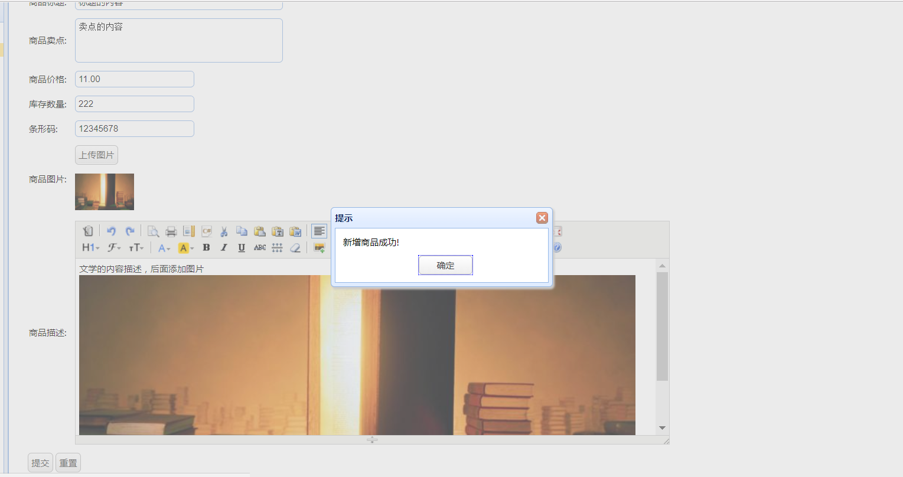

# java多表插入   

使用场景：项目使用的是SSM框架，现在有一个表A专门用来存商品信息，而另一个表B存商品描述，两个表通过id进行关联。现在在添加商品的时候，就需要同时添加表A的商品信息和表B的商品描述。

## 1. 前端实现    

```html
...
			<tr>
	            <td>条形码:</td>
	            <td>
	                <input class="easyui-textbox" type="text" name="barcode" data-options="validType:'length[1,30]'" />
	            </td>
	        </tr>
	        <tr>
	            <td>商品图片:</td>
	            <td>
	            	 <a href="javascript:void(0)" class="easyui-linkbutton picFileUpload">上传图片</a>
	                 <input type="hidden" name="image"/>
	            </td>
	        </tr>
	        <tr>
	            <td>商品描述:</td>
	            <td>
	                <textarea style="width:800px;height:300px;visibility:hidden;" name="desc"></textarea>
	            </td>
	        </tr>
...
```

_在以上前端页面，除了商品描述，其他属性都属于TbItem对象。_   

## 2.Controller接收   

因为商品描述跟商品信息不是同一张表，而逆向工程生成的pojo跟表一一对应，所以商品描述desc需要进行单独的获取。

```java
	@RequestMapping(value="/item/save",method=RequestMethod.POST)
	@ResponseBody
	private TaotaoResult createItem(TbItem item,String desc) throws Exception{
		return itemService.createItem(item , desc);
	}
```

_在SSM中，前端可以通过整个pojo对象传属性过来，也可以单独传一个属性过来。只要设置接收的参数即可。_

## 3.Service及其实现类    

```java
public interface ItemService {
	TaotaoResult createItem(TbItem item,String desc) throws Exception;
}

```

```java
	/**
	 * 添加商品信息
	 */
	@Override
	public TaotaoResult createItem(TbItem item,String desc) throws Exception{
	//item补全   
		//生成商品id
		Long itemId = IDUtils.genItemId();
		item.setId(itemId);
		//商品状态     1-正常  2-下架   3-删除
		item.setStatus((byte)1);
		item.setCreated(new Date());
		item.setUpdated(new Date());
		//插入到数据库
		itemMapper.insert(item);
		//添加商品描述信息
		TaotaoResult result = insertItemDesc(itemId, desc);
		if(result.getStatus() != 200){
			throw new Exception();
		}
		return TaotaoResult.ok();
	}
	/**
	 * 添加商品描述
	 * @param itemId
	 * @param desc
	 * @return
	 */
	private TaotaoResult insertItemDesc(Long itemId , String desc){
		TbItemDesc itemDesc = new TbItemDesc();
		itemDesc.setItemId(itemId);
		itemDesc.setItemDesc(desc);
		itemDesc.setCreated(new Date());
		itemDesc.setUpdated(new Date());
		itemDescMapper.insert(itemDesc);
		return TaotaoResult.ok();
	}
```

添加商品信息之后执行添加商品描述的方法，因为其为两次插入。为了保证事务的完整，对返回的结果进行判断，如果状态不为200，则抛出异常。

_状态码的规定和使用需要到一个工具类，详情见（7.[富文本编辑器](RichTextEditor.md)）。_

  