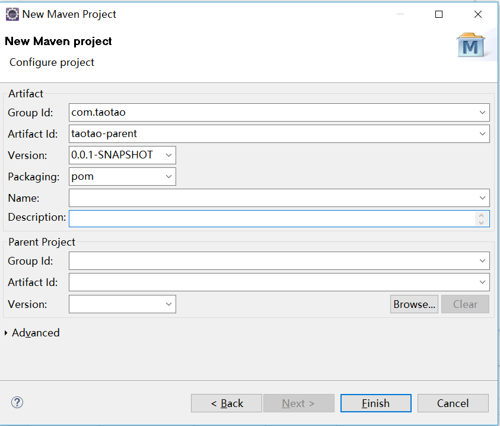
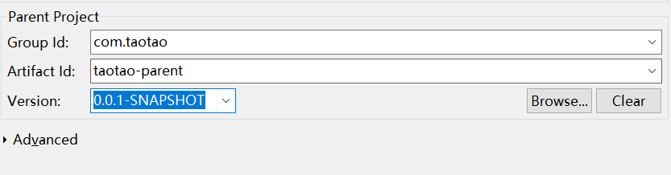

# maven工程搭建   

## 1.maven的仓库   

1. Maven在某个统一的位置存储所有项目的共享的构件（jar包），这个统一的位置，我们就称之为仓库。    
2. eclipse默认仓库位置：当前用户的.m2\repository文件夹下（例如：C:\Users\liyb\ .m2）   

只要把所需的jar包放在里面，maven就会根据pom.xml自动去找，如果本地仓库找不到，就回去远程仓库找。   

## 2.新建maven工程   

D：这个项目使用的是什么架构呢？

Z：分布式架构。

D：为什么要使用分布式架构，它有什么优点？

Z：分布式的项目有利于团队的分工，大家一个团队负责一个子系统。也有利于项目的解耦，某个功能模块可以单独升级。便于增加功能，只需添加子项目，调用其他系统的接口即可。

D：maven为什么要有子模块的概念，其跟项目之间的maven依赖又有什么区别呢？

Z：这主要涉及有三个标签的使用``<modules>,<parent>,<dependency>``    

D：``<modules>``标签的使用场景是？它有什么作用。

Z：聚合工程，将几个模块的内容聚合成一个工程，便于统一操作。在读取主项目的pom文件时去找到modules的配置，还会分别去编译他们引入的依赖。

D：``<parent>,<dependency>`` 两者的作用相似，他们之间又有什么区别呢？

Z：他们之间的区别可能是一种继承和引用的关系。

因为parent项目中的pom文件管理了所有项目的jar包版本，所以它被其他的项目继承``<parent>`` 。

而common项目的工具包，它的工具只有部门用户会用到，作为父工程继承不合适，所以更好地是引用它``<dependency>``。      

D：那本项目中，maven之间的继承引用是怎么实现的呢？

Z：

1.  parent工程：管理了所有的jar包版本 ，被所有的工程所继承 ``<parent>`` 。
2.  common工程：放了工具类的jar包
3.  manager工程：引用了common的工具包``<dependency>``，并且定义了底下的四个模块``<module>``   
4.  manager-pojo模块：通过继承manager工程``<parent>``，进而继承了parent工程，jar包
5.  manager-mapper模块：继承manager工程``<parent>``，并引用了pojo模块``<module>``，jar包。    
6.  manager-service模块：继承manager工程``<parent>``，并引用了mapper模块``<module>``，jar包。    
7.  manager-web模块：继承manager工程``<parent>``，并引用了service模块``<module>``，war包。  
8.  portal工程：是一个前端工程，引用了common工具类和pojo模块进行提取数据包装显示。
9.  rest工程：是一个负责显示api接口工程，引用了mapper模块进行对数据库的操作。
10.  search工程：是一个负责查询的api接口工程，引用了mapper模块进行对数据库的操作。

### 1.跳过模板的选择   

打勾  Create a simple project

### 2.新建项目解读   

  

- Group Id:组织id，同一个项目使用相同的groupId，一般为域名倒置  
- Artifact Id:打包jar/war后的名字    


- Packaging类型：
  - 父工程使用pom   
  - 被依赖的项目用jar  

## 3.pom.xml文件解析  

pom.xml文件用来配置版本信息，告诉程序需要去下载哪些jar包  

### 1.集中定义jar包版本号   

在parent中集中定义管理版本号，但不实际依赖   

_像个规划的，只管是哪个版本的，还没去仓库拿插件_  

```xml
	<!-- 集中定义依赖版本号 -->
	<properties>
		<junit.version>4.12</junit.version>
		<spring.version>4.1.3.RELEASE</spring.version>
		<mybatis.version>3.2.8</mybatis.version>
		<mybatis.spring.version>1.2.2</mybatis.spring.version>
		<mybatis.paginator.version>1.2.15</mybatis.paginator.version>
		<mysql.version>5.1.32</mysql.version>
		<slf4j.version>1.6.4</slf4j.version>
		<jackson.version>2.4.2</jackson.version>
		<druid.version>1.0.9</druid.version>
		<httpclient.version>4.3.5</httpclient.version>
		<jstl.version>1.2</jstl.version>
		<servlet-api.version>2.5</servlet-api.version>
		<jsp-api.version>2.0</jsp-api.version>
		<joda-time.version>2.5</joda-time.version>
		<commons-lang3.version>3.3.2</commons-lang3.version>
		<commons-io.version>1.3.2</commons-io.version>
		<commons-net.version>3.3</commons-net.version>
		<pagehelper.version>3.4.2-fix</pagehelper.version>
		<jsqlparser.version>0.9.1</jsqlparser.version>
		<commons-fileupload.version>1.3.1</commons-fileupload.version>
		<jedis.version>2.7.2</jedis.version>
		<solrj.version>4.10.3</solrj.version>
	</properties>
```

```xml 
	<dependencyManagement>
		<dependencies>
			<!-- 时间操作组件 -->
			<dependency>
				<groupId>joda-time</groupId>
				<artifactId>joda-time</artifactId>
				<version>${joda-time.version}</version>
			</dependency>
			<!-- Apache工具组件 -->
			<dependency>
				<groupId>org.apache.commons</groupId>
				<artifactId>commons-lang3</artifactId>
				<version>${commons-lang3.version}</version>
			</dependency>
			<dependency>
				<groupId>org.apache.commons</groupId>
				<artifactId>commons-io</artifactId>
				<version>${commons-io.version}</version>
			</dependency>
			<dependency>
				<groupId>commons-net</groupId>
				<artifactId>commons-net</artifactId>
				<version>${commons-net.version}</version>
			</dependency>
			<!-- Jackson Json处理工具包 -->
			<dependency>
				<groupId>com.fasterxml.jackson.core</groupId>
				<artifactId>jackson-databind</artifactId>
				<version>${jackson.version}</version>
			</dependency>
			<!-- httpclient -->
			<dependency>
				<groupId>org.apache.httpcomponents</groupId>
				<artifactId>httpclient</artifactId>
				<version>${httpclient.version}</version>
			</dependency>
			<!-- 单元测试 -->
			<dependency>
				<groupId>junit</groupId>
				<artifactId>junit</artifactId>
				<version>${junit.version}</version>
				<scope>test</scope>
			</dependency>
			<!-- 日志处理 -->
			<dependency>
				<groupId>org.slf4j</groupId>
				<artifactId>slf4j-log4j12</artifactId>
				<version>${slf4j.version}</version>
			</dependency>
			<!-- Mybatis -->
			<dependency>
				<groupId>org.mybatis</groupId>
				<artifactId>mybatis</artifactId>
				<version>${mybatis.version}</version>
			</dependency>
			<dependency>
				<groupId>org.mybatis</groupId>
				<artifactId>mybatis-spring</artifactId>
				<version>${mybatis.spring.version}</version>
			</dependency>
			<dependency>
				<groupId>com.github.miemiedev</groupId>
				<artifactId>mybatis-paginator</artifactId>
				<version>${mybatis.paginator.version}</version>
			</dependency>
			<dependency>
				<groupId>com.github.pagehelper</groupId>
				<artifactId>pagehelper</artifactId>
				<version>${pagehelper.version}</version>
			</dependency>
			<!-- MySql -->
			<dependency>
				<groupId>mysql</groupId>
				<artifactId>mysql-connector-java</artifactId>
				<version>${mysql.version}</version>
			</dependency>
			<!-- 连接池 -->
			<dependency>
				<groupId>com.alibaba</groupId>
				<artifactId>druid</artifactId>
				<version>${druid.version}</version>
			</dependency>
			<!-- Spring -->
			<dependency>
				<groupId>org.springframework</groupId>
				<artifactId>spring-context</artifactId>
				<version>${spring.version}</version>
			</dependency>
			<dependency>
				<groupId>org.springframework</groupId>
				<artifactId>spring-beans</artifactId>
				<version>${spring.version}</version>
			</dependency>
			<dependency>
				<groupId>org.springframework</groupId>
				<artifactId>spring-webmvc</artifactId>
				<version>${spring.version}</version>
			</dependency>
			<dependency>
				<groupId>org.springframework</groupId>
				<artifactId>spring-jdbc</artifactId>
				<version>${spring.version}</version>
			</dependency>
			<dependency>
				<groupId>org.springframework</groupId>
				<artifactId>spring-aspects</artifactId>
				<version>${spring.version}</version>
			</dependency>
			<!-- JSP相关 -->
			<dependency>
				<groupId>jstl</groupId>
				<artifactId>jstl</artifactId>
				<version>${jstl.version}</version>
			</dependency>
			<dependency>
				<groupId>javax.servlet</groupId>
				<artifactId>servlet-api</artifactId>
				<version>${servlet-api.version}</version>
				<scope>provided</scope>
			</dependency>
			<dependency>
				<groupId>javax.servlet</groupId>
				<artifactId>jsp-api</artifactId>
				<version>${jsp-api.version}</version>
				<scope>provided</scope>
			</dependency>
			<!-- 文件上传组件 -->
			<dependency>
				<groupId>commons-fileupload</groupId>
				<artifactId>commons-fileupload</artifactId>
				<version>${commons-fileupload.version}</version>
			</dependency>
			<!-- Redis客户端 -->
			<dependency>
				<groupId>redis.clients</groupId>
				<artifactId>jedis</artifactId>
				<version>${jedis.version}</version>
			</dependency>
			<!-- solr客户端 -->
			<dependency>
				<groupId>org.apache.solr</groupId>
				<artifactId>solr-solrj</artifactId>
				<version>${solrj.version}</version>
			</dependency>
		</dependencies>
	</dependencyManagement>
```

- dependencyManagement标签说明依赖由其管理
- 组件名称（Group Id，Artifact Id，同2-2），${XX.version}引用上方的版本号    


- 子工程依赖父工程的pom.xml文件不需要再定义版本：``<version>${solrj.version}</version>``    

D：``<dependencyManagement>``标签有什么作用？

Z：表示对jar包只是进行管理，依赖管理的意思。如果不添加该标签，所定义的jar包就会全部被子工程所继承。没得挑，全给。

jar包依赖的方式：

```xml
<!-- 依赖管理 -->
  <dependencies>
  	<dependency>
  		<groupId>com.taotao</groupId>
  		<artifactId>taotao-common</artifactId>
  		<version>0.0.1-SNAPSHOT</version>
  	</dependency>
  </dependencies>
```

### 2.添加插件依赖   

```xml
	<build>
		<finalName>${project.artifactId}</finalName>
		<plugins>
			<!-- 资源文件拷贝插件 -->
			<plugin>
				<groupId>org.apache.maven.plugins</groupId>
				<artifactId>maven-resources-plugin</artifactId>
				<version>2.7</version>
				<configuration>
					<encoding>UTF-8</encoding>
				</configuration>
			</plugin>
			<!-- java编译插件 -->
			<plugin>
				<groupId>org.apache.maven.plugins</groupId>
				<artifactId>maven-compiler-plugin</artifactId>
				<version>3.2</version>
				<configuration>
					<source>1.7</source>
					<target>1.7</target>
					<encoding>UTF-8</encoding>
				</configuration>
			</plugin>
		</plugins>
		<pluginManagement>
			<plugins>
				<!-- 配置Tomcat插件 -->
				<plugin>
					<groupId>org.apache.tomcat.maven</groupId>
					<artifactId>tomcat7-maven-plugin</artifactId>
					<version>2.2</version>
				</plugin>
			</plugins>
		</pluginManagement>
	</build>
```

- 编译插件可以解决部署项目的时候默认1.5jdk问题   
- tomcat插件使得调试更为方便       

_插件是一个工具，而jar包是一块打包的源码，其引入方式不同_     

### 3.使用插件依赖   

```xml
  <!-- tomcat插件 -->
  <build>
	  <plugins>
	  	<plugin>
			<groupId>org.apache.tomcat.maven</groupId>
			<artifactId>tomcat7-maven-plugin</artifactId>
			<configuration>
				<port>8080</port>
				<path>/</path>
			</configuration>
	  	</plugin>
	  </plugins> 
  </build>
```

将plugins标签拷过来，去除版本号，配置端口

设置运行为根目录/，不添加的话访问需要添加项目名   

### 4.自动生成的信息  

本身工程

```xml
	<groupId>com.taotao</groupId>
	<artifactId>taotao-common</artifactId>
	<version>0.0.1-SNAPSHOT</version>
```

依赖的父工程（工程依赖）

```xml
	<parent>
		<groupId>com.taotao</groupId>
		<artifactId>taotao-parent</artifactId>
		<version>0.0.1-SNAPSHOT</version>
	</parent>
```

子模块信息

```xml
  <modules>
  	<module>taotao-manager-pojo</module>
  	<module>taotao-manager-mapper</module>
  	<module>taotao-manager-service</module>
  	<module>taotao-manager-controller</module>
  </modules>
```


## 4.maven项目的分工   

### 1.聚合工程：taotao-parent  

所有项目的父工程，pom.xml定义了整个项目需要的所有jar包的版本

### 2.jar包：taotao-common   

通用的工具存放的地方，通过继承taotao.parent获取其管理的版本，并对插件进行实际依赖   

为了让其他包依赖共享，打成jar包。

Artifact Id为taotao-commom    

    

 ### 3.聚合工程：taotao-manager  

1. 为了代码共享，把mapper，pojo，service打成jar包，打包进war里面，合成一个pom聚合工程   
2. 该聚合工程需要依赖taotao-parent（工程依赖）和taotao-common(jar包依赖)    
3. 因为manager要运行tomcat插件，所以需要配置插件（端口：8080，根目录运行）     

_这是由几个jar包组成的聚合工程，再由聚合工程+jar包组成另一个大聚合工程_    

#### 1.pojo的jar包   

（创建模块的方式：pom工程右键--新建maven module）  

pojo为简单java对象，不需要依赖其他工程   

#### 2.mapper的jar包   

mapper的xml文件，接口需要使用pojo，所以依赖pojo的jar包。除此之外，    

因为mybatis之类的jar包只在mapper这里用到，所以之前依赖的jar包没有（像mybatis，分页插件，数据库驱动，连接池等），去parent的pom文件中寻找依赖添加到pom文件的依赖。  

_从上一级的依赖找jar包，缺的再去parent中找_  

#### 3.service的jar包   

service要把mapper注入进来，所以需要依赖mapper    

这里需要附加的jar包是spring相关的  

#### 4.controller的war包   

一个聚合工程必须有一个war包，需要依赖service，这样service及其依赖的都会传递过来   

附加的包有jsp相关的jar包  

因为缺少目录结构，创建的时候会报错，所以在src-main-webapp下新建WEB-INF - web.xml  

原始web.xml的内容：

```xml
<?xml version="1.0" encoding="UTF-8"?>
<web-app xmlns:xsi="http://www.w3.org/2001/XMLSchema-instance"
	xmlns="http://java.sun.com/xml/ns/javaee" xmlns:web="http://java.sun.com/xml/ns/javaee/web-app_2_5.xsd"
	xsi:schemaLocation="http://java.sun.com/xml/ns/javaee http://java.sun.com/xml/ns/javaee/web-app_2_5.xsd"
	id="taotao" version="2.5">
	<display-name>taotao-manager</display-name>
	<welcome-file-list>
		<welcome-file>index.html</welcome-file>
		<welcome-file>index.htm</welcome-file>
		<welcome-file>index.jsp</welcome-file>
		<welcome-file>default.html</welcome-file>
		<welcome-file>default.htm</welcome-file>
		<welcome-file>default.jsp</welcome-file>
	</welcome-file-list>
</web-app>
```

## 5.插件tomcat运行maven工程

### 1.前端页面位置  

根目录为webapp，在下面新建index.jsp页面就可以直接访问   

### 2.运行步骤  

1. 安装依赖的项目到本地仓库：

   右键被依赖项目 - run as - maven install  

_因为依赖的是我们自己创建的，本地仓库找不到，所以需要进行生成_    

2. 右键聚合工程 - run as - maven build  


3. Goals输入maven命令：

clean tomcat7:run

清空重新编译  运行tomcat7   （在parent中就已经对tomcat版本进行控制，只能使用7的版本）  

### 3.异常  

当启动多个tomcat就会报：``Failed to execute goal org.apache.maven.plugins:maven-clean-plugin:2.5``异常，这时候只要关闭所有的tomcat就可以了。  