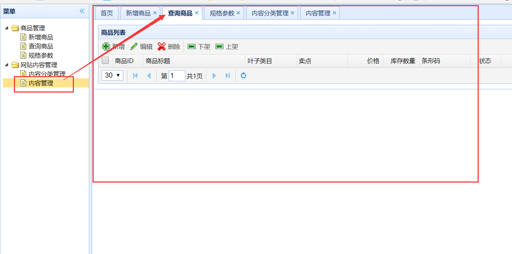

# Jsp页面跳转   

当我们从静态页面向动态页面跨越，静态页面直接调用另一个页面的地址，就可以跳转到该页面。而动态页面则一般都需要通过Controller进行跳转，这样做可以将jsp页面的真实地址隐藏起来，提高安全性。

## 1.springmvc跳转的条件   

1. springmvc.xml中配置了视图解析器

   ```xml
   	<bean
   		class="org.springframework.web.servlet.view.InternalResourceViewResolver">
   		<property name="prefix" value="/WEB-INF/jsp/" />
   		<property name="suffix" value=".jsp" />
   	</bean>
   ```

   视图解析器可以在跳转的时候自动补全文件头部与尾部的内容（详见上一章）   

   _例如  /WEB-INF/jsp/home/index.jsp   在解析器的帮助下只需写成   home/index_  

2. 文件放置在视图解析器指定的文件夹下，也就是``/WEB-INF/jsp/``   

## 2.首页的跳转   

1. 编写一个PageController，做页面跳转  

   ```java
   /**
    * 页面跳转Controller
    * @author liyb
    */
   @Controller
   public class PageController {
   	/**
   	 * 打开首页
   	 */
   	@RequestMapping("/")
   	public String showIndex(){
   		return "index";
   	}
   }
   ```

   当访问路径为/的时候，访问视图解析器下的index页面。    

## 3.跳转到其他页面  

```java
	/**
	 * 打开其他页面
	 */
	@RequestMapping("/{page}")
	public String showPage(@PathVariable String page){
		return page;
	}	
```

**@PathVariable **可以将 **URL **中占位符参数绑定到控制器处理方法的入参中,也就是{page}传到page中，因为url的跳转链接跟jsp的页面名相同：

```java  
	         		<li data-options="attributes:{'url':'item-add'}">新增商品</li>
	         		<li data-options="attributes:{'url':'item-list'}">查询商品</li>
	         		<li data-options="attributes:{'url':'item-param-list'}">规格参数</li>
```

item-add.jsp        item-list.jsp        item-param-list.jsp

直接通过访问jsp名就可以访问该jsp页面   

  