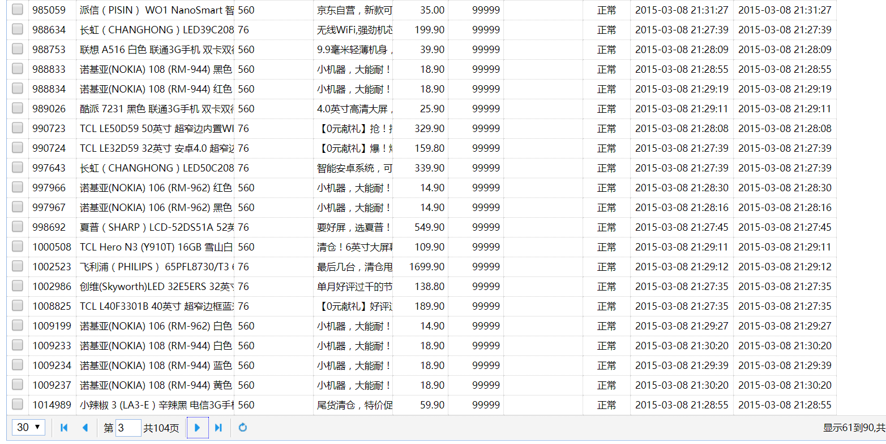

# pageHelper插件   

pagehelper是一个分页插件，其工作原理就是利用mybatis拦截器，在查询数据库的时候拦截下sql，修改sql使其实现分页效果。    

_在sql执行之前插一手，让其有别的附加功能。_

## 1.pagehelper使用条件   

1. 在parent工程的pom.xml文件中添加了maven依赖    

   ```xml
   <properties>	
   	<pagehelper.version>3.4.2-fix</pagehelper.version>
     ...
   </properties>  
   ```

   ```xml
   			<dependency>
   				<groupId>com.github.pagehelper</groupId>
   				<artifactId>pagehelper</artifactId>
   				<version>${pagehelper.version}</version>
   			</dependency>
   ```

_引入其jar包的过程。_  

## 2.测试pagehelper

### 1.配置拦截器插件   

在mybatis的xml（也就是SqlMapConfig.xml）里面配置(放在< configuration > 里)     

```xml
	<!-- 配置分页插件 -->
	<plugins>
		<plugin interceptor="com.github.pagehelper.PageHelper">
			<!-- 设置方言 -->
			<property name="dialect" value="mysql"/>			
		</plugin>
	</plugins>
```

_把拦截sql的权限交给了pagehelper，并且告诉它：你要拦截的sql是mysql类型的。_    

### 2.测试pagehelper   

使用Junit测试pagehelper：

```java
	@Test
	public void testPageHelper() {
		//创建一个spring容器
		ApplicationContext applicationContext = new ClassPathXmlApplicationContext("classpath:spring/applicationContext-*.xml");
		//获取Mapper代理对象
		TbItemMapper mapper = applicationContext.getBean(TbItemMapper.class);
		//执行查询并分页
		TbItemExample example = new TbItemExample();
		PageHelper.startPage(1, 10);
		List<TbItem> list = mapper.selectByExample(example);
		//取商品列表   
		for (TbItem tbItem : list) {
			System.out.println(tbItem.getTitle());
		}
		//取分页信息
		PageInfo<TbItem> pageInfo = new PageInfo<>(list);
		long total = pageInfo.getTotal();
		System.out.println("总共有商品信息条数："+total);
	}
```

1. 首先加载spring容器，spring容器里面有许多mapper映射类（由xxxMapper.xml转化而成），取出要使用的代理对象。

   ```java
   ApplicationContext applicationContext = new ClassPathXmlApplicationContext("classpath:spring/applicationContext-*.xml");
   TbItemMapper mapper = applicationContext.getBean(TbItemMapper.class);
   ```
   _在实际使用中mapper对象一般通过spring容器注入进来_  

2. 告诉pagehelper从哪一行开始，多少行一页   

   ```java
   PageHelper.startPage(1, 10);
   ```

3. 调用映射类的selectByExample方法查询所有的数据

   ```java
   List<TbItem> list = mapper.selectByExample(example);
   ```

   其example对象可用来限定查询条件，example为空，表示查询所有。   

4. PageInfo只要输入了所有的数据，它就可以对数据进行分页处理，通过PageInfo可以直接拿到数据的条数等信息。

   _pageInfo就像pagehelper的管家，关于分页管理的信息，直接问他就可以了。_     

_使用pagehelper就省去了原来编写新的sql语句，只需要告诉pagehelper从哪一行开始，多少行一页，它就会将其分好页，直接调用即可。_    

## 3.实战pageHelper   

### 1.必备条件   

我们打算用pageHelper获取数据，然后放在easyUI的datagrid中显示，然后使其具有分页效果。datagrid支持的是json的格式。

所以需要准备：

1. EasyUI插件   
2. 前端代码    
3. 放在数据库的数据信息   

### 2.创建EasyUI要用的pojo   

因为别的项目可能用到EasyUI的pojo，所以写一个通用的在common工程里。

```java
public class EUDataDridResult {
	private int total;
	private List<?> rows;
	public int getTotal() {
		return total;
	}
	public void setTotal(int total) {
		this.total = total;
	}
	public List<?> getRows() {
		return rows;
	}
	public void setRows(List<?> rows) {
		this.rows = rows;
	}
}
```

- 泛型使用<?>可以通用所有的类型，达到代码通用的效果。
- EasyUI的datagrid只需要知道两个信息：1.要显示的代码内容  2.总共的条数   

_使用pojo是为了把数据以特定的形式转化为json传给datagrid显示_

_common工程是一个工具箱，你做什么项目，带着这个工具箱过去，用到什么工具就在里面拿。所以平时有一些常用的工具，我们就会放进这个工具箱里面。_  

### 3.在Service工程中获取信息   

Service层分两部分，接口部分还有实现接口部分，通过service层将数据从数据库里面查出来。   

1. 接口定义   

   ```java
   EUDataDridResult getItemList(int page,int rows);
   ```

   page , rows是为调用pagehelper准备的，因为pagehelper的使用需要告诉它，从第几页开始，每页多少行。   

2. 接口实现

   ```java
   	public EUDataDridResult getItemList(int page, int rows) {
   		
   		TbItemExample example = new TbItemExample();
   		//分页处理   
   		PageHelper.startPage(page, rows);
   		List<TbItem> list = itemMapper.selectByExample(example);   
   		//创建返回值对象   
   		EUDataDridResult result = new EUDataDridResult();
   		result.setRows(list);
   		//取分页信息
   		PageInfo<TbItem> pageInfo = new PageInfo<>(list);
   		result.setTotal(pageInfo.getTotal());
   		
   		return result;
   	}
   ```

   通过pagehelper取出对象之后，将其对象返回给Controller    

### 4.Controller接收数据传到前台      

```java
	@RequestMapping("/item/list")
	@ResponseBody
	public EUDataDridResult getItemList(Integer page,Integer rows){
		EUDataDridResult result = itemService.getItemList(page, rows);
		return result;
	}
```

返回的虽然是pojo对象，但其会自动转化为json数据，需要添加@ResponseBody注解。    

### 5.前台页面显示    

```html
<table class="easyui-datagrid" id="itemList" title="商品列表" 
       data-options="singleSelect:false,collapsible:true,pagination:true,url:'/item/list',method:'get',pageSize:30,toolbar:toolbar">
    <thead>
        <tr>
        	<th data-options="field:'ck',checkbox:true"></th>
        	<th data-options="field:'id',width:60">商品ID</th>
            <th data-options="field:'title',width:200">商品标题</th>
            <th data-options="field:'cid',width:100">叶子类目</th>
            <th data-options="field:'sellPoint',width:100">卖点</th>
            <th data-options="field:'price',width:70,align:'right',formatter:TAOTAO.formatPrice">价格</th>
            <th data-options="field:'num',width:70,align:'right'">库存数量</th>
            <th data-options="field:'barcode',width:100">条形码</th>
            <th data-options="field:'status',width:60,align:'center',formatter:TAOTAO.formatItemStatus">状态</th>
            <th data-options="field:'created',width:130,align:'center',formatter:TAOTAO.formatDateTime">创建日期</th>
            <th data-options="field:'updated',width:130,align:'center',formatter:TAOTAO.formatDateTime">更新日期</th>
        </tr>
    </thead>
</table>
```

1. 前台页面请求了item/list这个url，传了每页30的rows属性过去，page初始化默认为0       
2. field指定了json的键，也就是pojo对象里面的属性，其th下的tr会将属性值显示出来。   

### 6.启动问题   

完成以上操作就可以启动项目了，但是由于EUDataDridResult.java是新添加的类，而启动manager的时候其是去仓库寻找，所以找到的是旧的jar包，需要右键common项目重新maven install 生成一个新的jar包，这样就能顺利找到该类文件了。    

实现了datagrid的展示和分页效果：

     