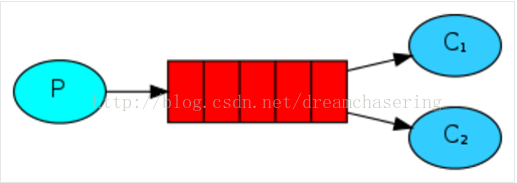
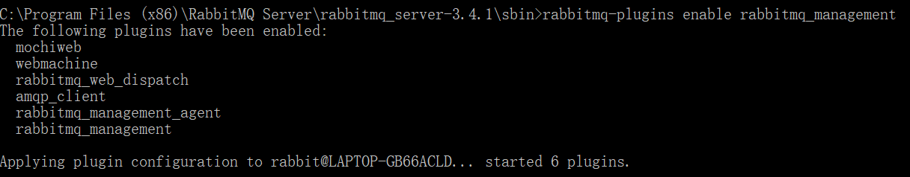
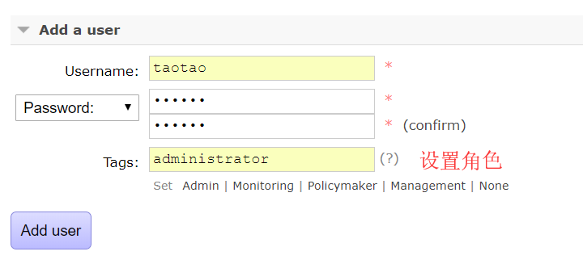
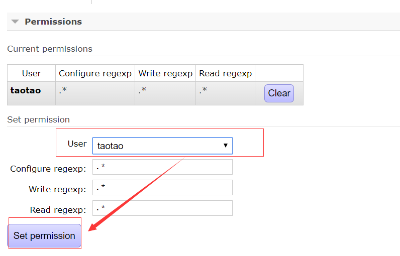

# rabbitMQ   

M：rabbitMQ怎么应用到项目中？

Z：MQ使用总结，小案例Demo  loading

M：rabbitMQ有什么作用？   

Z：简单来说就是消息队列，负责应用之间的通讯。   

  

M：接收方怎么接受信息呢？

Z：通过程序的阻塞等待信息发送，一旦接收即执行下一步。

M：rabbit怎么安装呢？

Z：安装Erlang，rabbitMQ，启动界面

1. 首先需要安装Erlang，win下要使用以管理员身份运行，默认安装路径C盘。

2. 然后才安装rabbitmq，安装完之后系统中有RabbitMQ，在服务中重启服务检测是否安装成功。

3. 安装完rabbitmq之后，右键cmd，使用管理员权限打开cmd。这时候cmd所在的目录为默认目录，还需要进去rabbitmq的安装目录下。（默认为``C:\Program Files (x86)\RabbitMQ Server\rabbitmq_server-3.4.1\sbin``）  

   进入sbin目录之后，执行命令 ``rabbitmq-plugins enable rabbitmq_management``。出来以下界面表明启动成功:

       

4. 登录``http://127.0.0.1:15672``即可进去登录界面，默认账号密码都为``guest``   

     

M：怎么设置账号呢？

Z：添加用户，设置路径，设置对应用户  

1. 添加用户

     

2. 设置访问路径  

     

3. 点击路径，指定角色，就可以通过用户名登录了

     

       

（07视频继续深入理解）

### linux下Erlang安装  

Z：首先需要安装erlang  

1. linux中下载erlang：``wget http://erlang.org/download/otp_src_R13B04.tar.gz``    

2. 解压文件  ``tar -xvf otp_src_18.3.tar.gz``  

3. 进入解压目录，配置安装编译代码``./configure --prefix=/usr/local/erlang``  

   **./configure过程中可能会出现大量命令缺少（configure: error），需要根据提示逐个进行安装**   

4. 成功执行./configure命令之后在erlang的目录中执行``make``   ，还有``make install``命令   

5. 配置环境变量： vim  /etc/profile

   ```properties
   #set erlang environment
   export PATH=$PATH:/usr/local/otp_src_R13B04/bin
   ```

   环境变量生效``source /etc/profile``    

M：怎么看erlang是否安装成功呢？

Z：进入erlang的/bin目录，执行``./erl``出现Erlang的相关信息即可，输入``halt().``可退出界面。

### linux下rabbitMQ安装  

Z：接下来安装rabbitMQ

1. linux中下载rabbitMQ：``wget http://www.rabbitmq.com/releases/rabbitmq-server/v3.6.1/rabbitmq-server-generic-unix-3.6.1.tar.xz``       

2. 解压文件：``xz -d rabbitmq-server-generic-unix-3.6.1.tar.xz``,

   ``tar -xvf rabbitmq-server-generic-unix-3.6.1.tar``   

3. 配置环境变量  (指定rabbitmq的sbin文件夹路径): vim  /etc/profile

   ```properties
   #set rabbitmq environment
   export PATH=$PATH:/opt/rabbitmq/sbin
   ```

   环境变量生效``source /etc/profile``    

4. 进入解压目录下的/sbin目录，启动服务``./rabbitmq-server -detached``   

M：怎么查看服务的启动状态呢？

Z：使用命令``./rabbitmqctl status``   

M：那怎么关闭服务呢？

Z：命令`` ./rabbitmqctl stop``   
