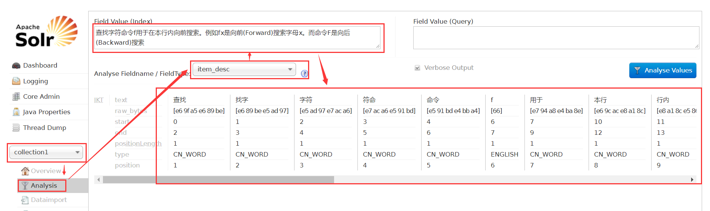

# solr的简单使用

M:solr是干嘛用的呢？

D:Solr是一个独立的企业级搜应用服务器，它对外提供类似于Web-service的API接口。用户可以通过http请求，向搜索引擎服务器提交一定格式的XML文件，生成索引；也可以通过Http Get操作提出查找请求，并得到XML格式的返回结果。solr将非结构化数据，通过分词、词法分析、过滤停词、语义分析等手段来转成结构化数据，存储为索引。

Z：就是说，solr是一种全网搜索，但是其还支持语义相同的关键词。（例如：搜索solr，却可以查询出来lucene内容）  

M:那安装solr服务器需要配置什么环境呢？

Z:jdk、tomcat  、IK Analyzer。

M:jdk怎么安装配置呢？

Z:1. 首先下载jdk安装包``jdk-7u55-linux-i586.tar.gz``。

2. 然后解压到指定的文件夹下``tar -zxvf jdk-7u55-linux-i586.tar.gz -C /usr/lib/jvm``

3. 配置环境变量``vim /etc/sysconfig/network-scripts/ifcfg-eth0``   

   ```properties
   export JAVA_HOME=/usr/lib/jvm/jdk1.7.0_55
   export JRE_HOME=${JAVA_HOME}/jre
   export CLASSPATH=.:${JAVA_HOME}/lib:${JRE_HOME}/lib
   export PATH=${JAVA_HOME}/bin:$PATH
   ```

4. 执行profile``source /etc/profile``即可检查jdk``java -version``是否安装成功了。   

M:tomcat安装在哪里呢？

Z:``/usr/local/solr/tomcat``  

M:那命令为：``tar -zxvf apache-tomcat-7.0.47.tar.gz -C /usr/local/solr/tomcat`` ,如果没有文件夹需要创建指定文件夹。

M:那现在可以安装solr了吧，solr安装到哪里呢？

Z:这个安装的方式可有点不同，具体操作是把``/dist/solr-4.10.3.war``复制到tomcat的webapps下，运行tomcat进行自动解压。（运行bin下的startup.sh） 

M:为什么我启动的时候报错：``tomcat Neither the JAVA_HOME nor the JRE_HOME environment variable is defined``  

Z:因为你使用的jdk不是通过yum安装的，而是下载拉进去的，虽然也配置了java_home，但tomcat不太智能，仍然没有自动识别出java_home路径。所以需要编辑文件，tomcat下的catalina.sh``tomcat/bin/catalina.sh``，添加以下两行代码在开头处：

```properties
# -----------------------------------------------------------------------------
export JAVA_HOME=/usr/lib/jvm/jdk1.7.0_55
export JRE_HOME=/usr/lib/jvm/jdk1.7.0_55/jre
```

M:如果要看tomcat的启动情况怎么做？

Z:可以用``tail -f logs/catalina.out``查看日志。  

M:那tomcat要怎么关闭呢？

Z: 执行bin下的shutdown.sh，顺便说一下，war包的删除需要关闭tomcat。

M:除了war包，还需要别的什么吗？

Z:还有 jar包  &  配置文件

1. 把``solr-4.10.3/example/lib/ext``下的jar包复制到webapps的``/webapps/solr-4.10.3/WEB-INF/lib``中。
2. 拷贝log4j.properties文件，在Tomcat下webapps\solr\WEB-INF目录中创建文件 classes文件夹，复制Solr目录下``example\resources\log4j.properties``至Tomcat下``webapps\solr\WEB-INF\classes``目录。 
2. 把``solr-4.10.3/example/``下的solr拷贝到``/usr/local/solr/solrhome``与tomcat同级的目录下:``cp -r solr /usr/local/solr``(文件夹需要添加-r)

M:但是solr工程怎么知道自己的配置文件在哪里呢？

Z:所以需要修改solr工程的web.xml文件，配置JNDI，指向配置文件的目录

```xml
    <env-entry>
       <env-entry-name>solr/home</env-entry-name>
       <env-entry-value>/usr/local/solr/solrhome</env-entry-value>
       <env-entry-type>java.lang.String</env-entry-type>
    </env-entry>
```

M:完成之后怎么测试呢？

Z:linux中启动tomcat，然后进行访问8080/solr看看有没有solr页面，有则搭建成功了。

M:但是为什么我现在显示当前机子无法访问目标主机呢？

Z:你可以尝试使用Nat自动获取ip的方式，如果这样可以ping得通的话，就可以启动后进行访问了（记得修改解压文件夹名为solr）。

M：安装完solr之后要怎么使用呢？

Z：需要先配置中文分析器，再配置业务字段。

M：什么是中文分析器？

Z：中文分词器 IK Analyzer 。例如输入 ``基于java语言开发的轻量级的中文分词工具包``,可以自动切割为``基于|java|语言|开发|的|轻量级|的|中文|分词|工具包|``。    

M：IK Analyzer怎么安装呢？

Z：安装IK Analyzer步骤如下

1. 需要把IK Analyzer 的jar包``IKAnalyzer2012FF_u1.jar`` 添加到solr工程的lib文件夹下。   

2. 拷贝IK Analyzer 的配置文件``IKAnalyzer.cfg.xml``,相关字典``ext_stopword.dic,mydict.dic``到WEB-INF的classes文件夹下，如果没有该文件夹，新建一个。   

3. 配置文件配置fieldType，位置在``/solrhome/collection1/conf/schema.xml``   

   ```xml
   <fieldType name="text_ik" class="solr.TextField">
     <analyzer class="org.wltea.analyzer.lucene.IKAnalyzer"/>
   </fieldType>
   ```

M：那业务字段要怎么配置呢？

Z：首先要确定配置哪些字段。

M：那要怎么判断这字段需不需要配置呢？

Z：判断标准   1.搜索时是否需要该字段	2.后序业务用到不

需要用到字段如下

```
商品id
商品title
卖点
价格
商品图片
商品分类名称
商品描述
```

M：添加在哪里呢？

Z：之前的``schema.xml``文件中

```xml
<field name="item_title" type="text_ik" indexed="true" stored="true"/>
<field name="item_sell_point" type="text_ik" indexed="true" stored="true"/>
<field name="item_price"  type="long" indexed="true" stored="true"/>
<field name="item_image" type="string" indexed="false" stored="true" />
<field name="item_category_name" type="string" indexed="true" stored="true" />
<field name="item_desc" type="text_ik" indexed="true" stored="false" />

<field name="item_keywords" type="text_ik" indexed="true" stored="false" multiValued="true"/>
<copyField source="item_title" dest="item_keywords"/>
<copyField source="item_sell_point" dest="item_keywords"/>
<copyField source="item_category_name" dest="item_keywords"/>
<copyField source="item_desc" dest="item_keywords"/>
```

M：name对应的是id，stored是什么意思？

Z：stored为true的时候表示存储，存储不存储根据是否搜索该信息决定，desc描述只用于展示，所以不需要存储。   

M：下面的``copyField``是什么，有什么作用？

Z：复制域，是一种优化方式。把其他域复制到一块域上，更便于搜索。

M：那怎么测试业务字段是否配置成功呢？

Z：选择colletion1，如果FieldType下拉框中有添加的业务字段，并且对中文成功分割，则说明IK Analyzer中文分析器已配置成功。   

      


   


