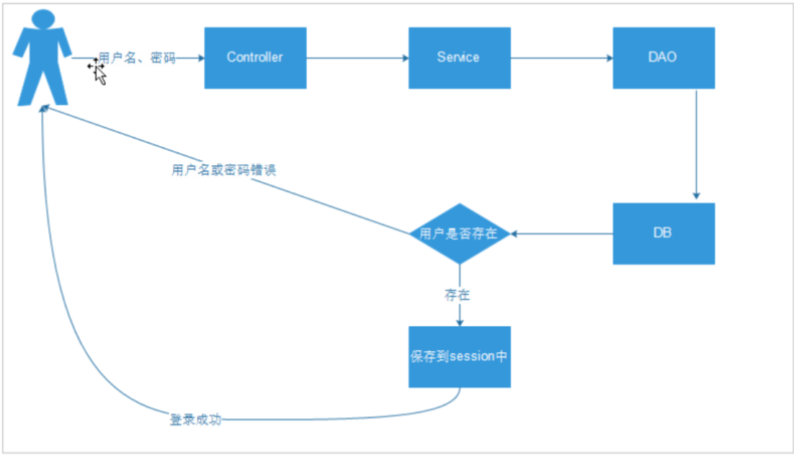

# 单点登录 （深入理解，重新整理，减法方式ing）  

_2018-10-27修改_

M：普通的项目实现登录的方式？

Z：登录之后该用户的信息就会保存到session中，根据session的信息就能判断用户是否登录

  

M：session具体是什么东西呢？

Z：session是保存在服务端的数据结构，当用户成功登录的时候，服务器就会将用户数据存入session中，然后将session ID返回给客户端。

服务端保存Session的方法很多，内存、数据库、文件都有，甚至还有session服务器集群。

```java
session.setAttribute("uname", uname);
```

M：那cookie跟session有什么关系呢？

Z：session是存在服务器上的，服务器上许多不同用户的session。要怎么区分开呢？主要就是根据session ID，服务器将session ID分发到不同的客户端上，存进客户端的cookie中。

```java
        Cookie cookie = new Cookie("JSESSIONID",session.getId());
        cookie.setMaxAge(2*7*24*3600);
        // 需要response对象，将Cookie写入本地浏览器
        response.addCookie(cookie);
```

而客户端在之后的请求中，就会把cookie发送到服务端，服务端就知道该用户是谁了。

M：那如果我浏览器禁止了cookie，session不就失效了吗？

Z：可以通过其他方式解决，例如在请求的url中传递session ID过去

M：那如果我们现在采用的是分布式系统，一个系统知道你是哪个session，其他系统不知道，这种情况该怎么解决呢？

Z：这就要实现session的共享，常用的方式如下：

1. 客户端Cookie保存

   因为问题是多个系统没法获取到同一个session，那干脆就把session扔到客户端上。这样不管客户端访问哪个系统，都会把用户信息带过去。

   缺点1：但是由于用户信息在客户端的Cookie上，如果客户自己修改Cookie，那不就可以随意篡改系统数据了。所以还需要额外对Cookie中的session信息进行加密。

   缺点2：客户端每次访问都要带着大量的session信息，占用了带宽。

   缺点3：http信息头限制Cookie信息的长度。

2. 服务器间复制session

   用户在主服务器登录，主服务器使用脚本或守护进程方式，将session传递到从服务器中。

   缺点1：如果主服务器挂了，其他从服务器将登录不了。

   缺点2：如果访问比较密集，还没来得及复制，会导致重复登录的情况。

3. 数据库存储session

   因为不同的系统访问同一个数据库。session存入数据库中，每次请求就去查询一次数据库。

   缺点1：对数据库要求比较高

   缺点2：需要额外实现session，更新删除代码，增加工作量

   本文主要介绍的是这种方式，使用redis代替关系数据库。而redis也能方便设置session的生存时间，更新等操作。

Z：对于用redis来存储session信息，将由单独一个系统来完成，那就是sso服务层

	    

	sso服务层主要是提供功能接口：

- 登录接口

- 注册接口

- 查询接口

- 退出登录接口  

---

下面是代码示例：

### 1.注册接口

D：做 **注册接口** 的时候，要对用户注册信息唯一性进行验证，用什么方式进行验证呢？

Z：通过将用户注册信息传到数据库进行匹配，参数缺陷、已有参数不让注册

Controller

```java
	@RequestMapping("/check/{param}/{type}")
	@ResponseBody
	public Object checkData(@PathVariable String param,@PathVariable Integer type, String callBack){
		
		TaotaoResult result = null;
		
		//参数有效性验证
		if(StringUtils.isBlank(param)){
			result = TaotaoResult.build(400, "校验内容不能为空");
		}
		if(type == null){
			result = TaotaoResult.build(400, "校验内容类型不能为空");
		}
		if(type != 1 && type != 2 && type != 3){
			result = TaotaoResult.build(400, "校验内容类型错误");
		}
		//校验出错
		if(null != result){
			if(null != callBack){
				MappingJacksonValue mappingJacksonValue = new MappingJacksonValue(result);
				mappingJacksonValue.setJsonpFunction(callBack);
				return mappingJacksonValue;
			}else{
				return result;
			}
		}
		//调用服务
		try {
			result = userService.checkData(param, type);
		} catch (Exception e) {
			result = TaotaoResult.build(500, ExceptionUtil.getStackTrace(e));
		}
		//校验出错
		if(null != callBack){
			MappingJacksonValue mappingJacksonValue = new MappingJacksonValue(result);
			mappingJacksonValue.setJsonpFunction(callBack);
			return mappingJacksonValue;
		}else{
			return result;
		}
	}
```

D：MappingJacksonValue有什么作用？

Z：它是spring提供的包装方法，可以将对象包装为回调函数进行返回。callBack参数就是回调函数的参数名。

Service：通过manager-mapper项目对数据库进行访问

```java
	@Autowired
	private TbUserMapper userMapper;   //从manager-mapper注入过来
	
	public TaotaoResult checkData(String content, Integer type) {
		//创建查询条件
		TbUserExample example = new TbUserExample();
		Criteria criteria = example.createCriteria();
		//数据进行校验  1、2、3分别代表username、phone、email
		//用户名校验
		if(1 == type){
			criteria.andUsernameEqualTo(content);
		}else if(2 == type){
			criteria.andPhoneEqualTo(content);
		}else{
			criteria.andEmailEqualTo(content);
		}
		//执行查询
		List<TbUser> list = userMapper.selectByExample(example);
		if(list == null || list.size() == 0){
			return TaotaoResult.ok(true);
		}
		return TaotaoResult.ok(false);
	}
```

提供的接口为:``http://localhost:8084/user/check/11/4``   

D：注册接口已经做好，但是没有前端页面，怎么对其进行测试？

Z：使用post请求的工具RESTClient，模拟前端页面

  

表单的Content-Type为application/x-www-form-urlencoded，添加表单参数即可模拟POST请求。

### 2.登录接口

D：登陆需要做什么动作呢？

Z：传用户名、密码到后台，加密之后与数据库进行比对，比对成功生成一个token，将token作为key、value作为用户信息存进redis中。

Controller

```java
	//用户登陆
	@RequestMapping(value="/login",method=RequestMethod.POST)    //仅支持post，不添加都支持
	@ResponseBody
	public TaotaoResult userLogin(String username, String password){
		try {
			TaotaoResult result = userService.userLogin(username, password);
			return result;
		} catch (Exception e) {
			e.printStackTrace();
			return TaotaoResult.build(500, ExceptionUtil.getStackTrace(e));
		}
	}
```

Service

```java
	/**
	 * 用户登陆
	 */
	@Override
	public TaotaoResult userLogin(String username, String password) {
		TbUserExample example = new TbUserExample();
		Criteria criteria = example.createCriteria();
		criteria.andUsernameEqualTo(username);
		List<TbUser> list = userMapper.selectByExample(example);
		//如果没有此用户名
		if(null == list || list.size() == 0){
			return TaotaoResult.build(400, "用户名或密码错误");
		}
		//比对密码
		TbUser user = list.get(0);
		if(!DigestUtils.md5DigestAsHex(password.getBytes()).equals(user.getPassword())){
			return TaotaoResult.build(400, "用户名或密码错误");
		}
		//清除密码
		user.setPassword(null);
		//生成token
		String token = UUID.randomUUID().toString();
		//把用户信息写入redis
		
		jedisClient.set(REDIS_USER_SESSION_KEY+":"+token, JsonUtils.objectToJson(user));      //key分组命名
		//设置session的过期时间
		jedisClient.expire(REDIS_USER_SESSION_KEY+":"+token, SSO_SESSION_EXPIRE);     
		
		return TaotaoResult.ok(token);    //最终返回一个token（令牌）
	}
```

把用户信息存进redis表示已经登录，然后返回一个token便于调用。

M：token是什么？

Z：token又叫做令牌，只是一个key，用来标识信息所在位置。

### 3.查询接口

D：怎么实现调用``127.0.0.1:8084/user/token/{token}``返回redis上用户信息的接口呢？   

Z：通过Get请求，传token去redis中请求用户数据

Controller

```java
	@RequestMapping(value="/token/{token}")    //支持get请求
	@ResponseBody
	public Object getUserByToken(@PathVariable String token, String callback){  //获取url的token值
		TaotaoResult result = null;
		try {
			result = userService.getUserByToken(token);
		} catch (Exception e) {
			e.printStackTrace();
			result = TaotaoResult.build(500, ExceptionUtil.getStackTrace(e));
		}
		if(StringUtils.isEmpty(callback)){  //非json调用
			return result;    //直接返回对象
		}else{
			MappingJacksonValue mappingJacksonValue = new MappingJacksonValue(result);
			mappingJacksonValue.setJsonpFunction(callback);
			return mappingJacksonValue;   //返回callback对象
		}
	}
```

Service

```java
	/**
	 * 获取用户信息
	 */
	@Override
	public TaotaoResult getUserByToken(String token) {
		String userStr = jedisClient.get(REDIS_USER_SESSION_KEY+":"+token);
		if(StringUtils.isNotEmpty(userStr)){
			//延长过期时间
			jedisClient.expire(REDIS_USER_SESSION_KEY+":"+token, SSO_SESSION_EXPIRE);     
			return TaotaoResult.ok(JsonUtils.jsonToPojo(userStr, TbUser.class));
		}
		return TaotaoResult.build(400, "此session已过期，请重新登录");
	}
```

获取用户信息，每请求一次就延长token时间。

M：到这里，sso项目就实现了注册，校验，登录，获取用户信息的接口。

### 4.前端处理

D：检查用户方法check的``escape($("#regName").val())+"/1?r=" + Math.random()``有什么作用？

Z：escape可以对字符串进行编码，这样就可以在所有的计算机上读取该字符串。而加上随机数可以防止被浏览器缓存，从而重复提交。

D：这段jq代码是怎么防止用户快速点击提交的。

Z：先进行重复性校验，然后使用每次随机数的方式，处理因为缓存通过校验问题。

D：我想登录成功之后跳转到某个页面，怎么实现呢？

Z：首先进入跳转页面的Controller的时候，把跳转地址作为参数传过去``http://localhost:8084/page/login?redirect=http://github.com/leekoko``  

```java
	@RequestMapping("/login")
	public String showLogin(String redirect, Model model){
		model.addAttribute("redirect", redirect);
		return "login";
	}
```

在前端进行账号密码验证，通过之后就会跳到``redirect``参数的地址

```javascript
			doLogin:function() {
				$.post("/user/login", $("#formlogin").serialize(),function(data){
					if (data.status == 200) {
						alert("登录成功！");
						if (redirectUrl == "") {
							location.href = "http://localhost:8081";
						} else {
							location.href = redirectUrl;
						}
					} else {
						alert("登录失败，原因是：" + data.msg);
						$("#loginname").select();
					}
				});
			},
```

### 5.代码应用场景

D：系统是怎么发现你现在是登录状态的呢？

Z：登录的时候将token存进cookie中，然后到首页的时候前端拿着token里的cookie，去请求用户信息。

存入cookie

```java
	/**
	 * 用户登陆
	 */
	@Override
	public TaotaoResult userLogin(String username, String password, HttpServletRequest request, HttpServletResponse response) {
...
		
		jedisClient.set(REDIS_USER_SESSION_KEY+":"+token, JsonUtils.objectToJson(user));      //key分组命名
		//设置session的过期时间
		jedisClient.expire(REDIS_USER_SESSION_KEY+":"+token, SSO_SESSION_EXPIRE);		 //添加写cookie的逻辑
		CookieUtils.setCookie(request, response, "TT_TOKEN", token);
		
		return TaotaoResult.ok(token);   //最终返回一个token
	}
```

前端获取cookie里的token，做请求

```javascript
var TT = TAOTAO = {
	checkLogin : function(){
		var _ticket = $.cookie("TT_TOKEN");
		if(!_ticket){
			return ;
		}
		$.ajax({
			url : "http://localhost:8084/user/token/" + _ticket,
			dataType : "jsonp",
			type : "GET",
			success : function(data){
				if(data.status == 200){
					var username = data.data.username;
					var html = username + "，欢迎来到淘淘！<a href=\"http://www.taotao.com/user/logout.html\" class=\"link-logout\">[退出]</a>";
					$("#loginbar").html(html);
				}
			}
		});
	}
}

$(function(){
	// 查看是否已经登录，如果已经登录查询登录信息
	TT.checkLogin();
});
```

拿到token之后就可以往redis里面请求用户信息，调用之前的redis获取用户信息接口

```java
	@RequestMapping(value="/token/{token}")    //支持get请求
	@ResponseBody
	public Object getUserByToken(@PathVariable String token, String callback){  //获取url的值
		TaotaoResult result = null;
		try {
			result = userService.getUserByToken(token);
		} catch (Exception e) {
			e.printStackTrace();
			result = TaotaoResult.build(500, ExceptionUtil.getStackTrace(e));
		}
		if(StringUtils.isEmpty(callback)){  //非json调用
			return result;    //直接返回对象
		}else{
			MappingJacksonValue mappingJacksonValue = new MappingJacksonValue(result);
			mappingJacksonValue.setJsonpFunction(callback);
			return mappingJacksonValue;   //返回callback对象
		}

	}
```

M：``CookieUtils.setCookie(request, response, "TT_TOKEN", token);``添加cookie的逻辑是怎么样的？

Z：如下代码:设定cookie名，cookie值，域名信息。放进response里。

```java
    /**
     * 设置Cookie的值，并使其在指定时间内生效
     * 
     * @param cookieMaxage cookie生效的最大秒数
     */
    private static final void doSetCookie(HttpServletRequest request, HttpServletResponse response,
            String cookieName, String cookieValue, int cookieMaxage, String encodeString) {
        try {
            if (cookieValue == null) {
                cookieValue = "";
            } else {
                cookieValue = URLEncoder.encode(cookieValue, encodeString);
            }
            Cookie cookie = new Cookie(cookieName, cookieValue);  //"TT_TOKEN"   token
            if (cookieMaxage > 0)
                cookie.setMaxAge(cookieMaxage);
            if (null != request) {// 设置域名的cookie
            	String domainName = getDomainName(request);
            	System.out.println(domainName);
                if (!"localhost".equals(domainName)) {
                	cookie.setDomain(domainName);
                }
            }
            cookie.setPath("/");
            response.addCookie(cookie);
        } catch (Exception e) {
        	 e.printStackTrace();
        }
    }
```

D：怎么做到当用户访问指定页面时，实现强制登录呢？

Z：用到拦截器，拦截器写在展示页面项目中，实现接口``implements HandlerInterceptor``

D：拦截器拦截url的写法？

Z：在handle之前执行拦截方法

```java
	@Autowired
	private UserServiceImpl userService;    //注入实现类，才能取到具体参数
	
...
	public boolean preHandle(HttpServletRequest request, HttpServletResponse response, Object arg2) throws Exception {
		//handler执行之前
		//从cookie中取token
		String token = CookieUtils.getCookieValue(request, "TT_TOKEN");
		//取用户信息
		TbUser user = userService.getUserByToken(token);
		//取不到用户跳转到登录页面
		if(user == null){
			response.sendRedirect(userService.SSO_BASE_URL + userService.SSO_PAGE_LOGIN 
					+ "?redirect=" + request.getRequestURL());  //获取拦截的url
			//不继续执行
			return false;
		}
		//取到用户信息继续执行
		return true;    //返回值决定handler是否执行
	}

```

HttpClient通过拿token调用sso服务获取用户信息，获取得到就执行被拦截方法，获取不到就不执行。

而调用服务方法，还有跳转路径通过``UserServiceImpl``注入类注入进来

M：``String token = CookieUtils.getCookieValue(request, "TT_TOKEN");``CookieUtils到底在request中做了什么？

Z：如下代码

```java
    /**
     * 得到Cookie的值,
     * 
     * @param request
     * @param cookieName
     * @return
     */
    public static String getCookieValue(HttpServletRequest request, String cookieName, boolean isDecoder) {
        //从request中获取所有Cookie
        Cookie[] cookieList = request.getCookies();
        if (cookieList == null || cookieName == null) {
            return null;
        }
        String retValue = null;
        try {
            for (int i = 0; i < cookieList.length; i++) {
                //匹配拿到指定的Cookie
                if (cookieList[i].getName().equals(cookieName)) {
                    if (isDecoder) {
                        retValue = URLDecoder.decode(cookieList[i].getValue(), "UTF-8");
                    } else {
                        //返回Cookie的值
                        retValue = cookieList[i].getValue();
                    }
                    break;
                }
            }
        } catch (UnsupportedEncodingException e) {
            e.printStackTrace();
        }
        return retValue;
    }
```

M：拦截器怎么拦截指定访问路径呢？

Z：在springmvc.xml中将url配置给拦截器类

```xml
	<!-- 拦截配置 -->
	<mvc:interceptors>
		<mvc:interceptor>
			<!-- 拦截订单请求 -->
			<mvc:mapping path="/item/**"/>
			<bean class="com.taotao.portal.interceptor.LoginInterceptor"/>
		</mvc:interceptor>
	</mvc:interceptors>
```

M：添加商品到购物车，要怎么实现呢？

Z：通过操作Cookie来实现(可以减少数据库的压力)，当点击收藏，将查到的商品信息转化为json存进cookie中，如果已有商品，则数量+1

```java
	@Override
	public TaotaoResult aadCartItem(long itemId, int num, 
			HttpServletRequest request, HttpServletResponse response) {
		CartItem cartItem = null;
		//获取Cookie中的信息
		List<CartItem> list = getCartList(request);
		for (CartItem cItem : list) {
			if(cItem.getId() == itemId){
				cItem.setNum(cItem.getNum() + num);
				cartItem = cItem;
				break;
			}
		}
		if(cartItem == null){
			//根据id查询商品信息
			String json = HttpClientUtil.doGet(REST_BASE_URL + ITEM_INFO_URL + itemId);
			//把json转化为java对象
			TaotaoResult result = TaotaoResult.formatToPojo(json, TbItem.class);
			if(result.getStatus() == 200){
				TbItem item = (TbItem) result.getData();
				//将不需要的信息进行精简,创建一个新的pojo
				cartItem.setId(itemId);
				cartItem.setImage(item.getImage());
				cartItem.setNum(1);
				cartItem.setPrice(item.getPrice());
				cartItem.setTitle(item.getTitle());
			}
			
		}
		list.add(cartItem);
		CookieUtils.setCookie(request, response, "TT_CART", JsonUtils.objectToJson(list),true);
		return TaotaoResult.ok();
	}

	private List<CartItem> getCartList(HttpServletRequest request) {
		
		String json = CookieUtils.getCookieValue(request, "TT_CART", true);
		if(StringUtils.isEmpty(json)){
			return new ArrayList<>();
		}
		try {
			List<CartItem> list = JsonUtils.jsonToList(json, CartItem.class);
			return list;
		} catch (Exception e) {
			e.printStackTrace();
		}
		return new ArrayList<>();
	}
```

D：那要怎么展示购物车列表呢？

Z：在跳转购物车页面的时候将cookie的信息取出来

D：前面添加购物车的时候，如果刷新add方法的链接，会重复进行添加，怎么处理。

Z：将页面链接和添加逻辑分离开来

```java
	@RequestMapping("/add/{itemId}")
	public String addCartItem(@PathVariable Long itemId, @RequestParam(defaultValue = "1")Integer num,
			HttpServletRequest request, HttpServletResponse response){
		TaotaoResult result = cartService.aadCartItem(itemId, num, request, response);
		//return "cartSuccess";
		return "redirect:/cart/success.html";   //重定义绝对路径
	}
	
	@RequestMapping("/success")
	public String showSuccess(HttpServletRequest request, HttpServletResponse response){
		return "cartSuccess";
	}
```

D：为什么要使用``return "redirect:/cart/success.html";``绝对路径呢?

Z：因为我要调用的是本Controller的请求方法，而不是页面，所以用绝对路径来请求Controller，这样做可以将浏览器的链接变成``cart/success.html``   

而``cart/success.html``调用的则存储是一个跳转页面方法。

M：购物车的数量怎么进行调整呢？

Z：请求添加购物车方法，把num设置为+1，-1

``/cart/add/"+_thisInput.attr("itemId") + ".html?num=-1``   

M：``List<TbUser> list = userMapper.selectByExample(example);``这里的userMapper直接使用的是接口，而mybatis的xml使用的是taotao-manage的，通过maven依赖过来。但是在lib里找不到，是没有打jar包过来的吗？  

Z：有，jar包里存在mapper，并且还能打开。   

M：直接访问``http://localhost:8080/service/user/doLogin?r=0.5910478177075487``返回``该服务没有了，以后别调用了，请访问ssoquery.taotao.com或dubbo中的服务。``,暂时原因不详。   

M：怎么实现踢人操作？

Z：把session id作为value，登录用户作为session存进cookie中，每次登录进行提取，如果有就将旧的session删除，并且更新session id
