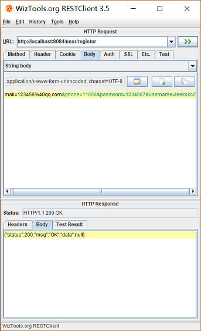

# 单点登录   

Z：session共享可以处理tomcat集群时，session不一致，导致重复登录的问题。

D：系统分布式部署的时候，session不能用session共享的方式，怎么做？

Z：将session放在redis中，设置key的生存时间。  

所以我们需要添加一个单点登录的服务，来构造SSO登录框架

  

M：这个系统需要有什么功能？

Z：它要实现以下几个接口   

-  登录接口

- 注册接口


- 查询接口


- 退出登录接口  

D：做注册接口的时候，要对用户注册信息唯一性进行验证，用什么方式进行验证呢？

Z：通过将用户注册信息传到数据库进行匹配，参数缺陷、已有参数不让注册

Controller

```java
	@RequestMapping("/check/{param}/{type}")
	@ResponseBody
	public Object checkData(@PathVariable String param,@PathVariable Integer type, String callBack){
		
		TaotaoResult result = null;
		
		//参数有效性验证
		if(StringUtils.isBlank(param)){
			result = TaotaoResult.build(400, "校验内容不能为空");
		}
		if(type == null){
			result = TaotaoResult.build(400, "校验内容类型不能为空");
		}
		if(type != 1 && type != 2 && type != 3){
			result = TaotaoResult.build(400, "校验内容类型错误");
		}
		//校验出错
		if(null != result){
			if(null != callBack){
				MappingJacksonValue mappingJacksonValue = new MappingJacksonValue(result);
				mappingJacksonValue.setJsonpFunction(callBack);
				return mappingJacksonValue;
			}else{
				return result;
			}
		}
		//调用服务
		try {
			result = userService.checkData(param, type);
		} catch (Exception e) {
			result = TaotaoResult.build(500, ExceptionUtil.getStackTrace(e));
		}
		//校验出错
		if(null != callBack){
			MappingJacksonValue mappingJacksonValue = new MappingJacksonValue(result);
			mappingJacksonValue.setJsonpFunction(callBack);
			return mappingJacksonValue;
		}else{
			return result;
		}
	}
```

D：MappingJacksonValue有什么作用？

Z：它是spring提供的包装方法，可以将对象包装为回调函数进行返回。callBack参数就是回调函数的参数名。

Service：通过manager-mapper项目对数据库进行访问

```java
	@Autowired
	private TbUserMapper userMapper;   //从manager-mapper注入过来
	
	public TaotaoResult checkData(String content, Integer type) {
		//创建查询条件
		TbUserExample example = new TbUserExample();
		Criteria criteria = example.createCriteria();
		//数据进行校验  1、2、3分别代表username、phone、email
		//用户名校验
		if(1 == type){
			criteria.andUsernameEqualTo(content);
		}else if(2 == type){
			criteria.andPhoneEqualTo(content);
		}else{
			criteria.andEmailEqualTo(content);
		}
		//执行查询
		List<TbUser> list = userMapper.selectByExample(example);
		if(list == null || list.size() == 0){
			return TaotaoResult.ok(true);
		}
		return TaotaoResult.ok(false);
	}
```

提供的接口为:``http://localhost:8084/user/check/11/4``   

D：注册接口已经做好，但是没有前端页面，怎么对其进行测试？

Z：使用post请求的工具RESTClient，模拟前端页面

  

表单的Content-Type为application/x-www-form-urlencoded，添加表单参数即可模拟POST请求。

D：登陆需要做什么动作呢？

Z：传用户名、密码到后台，加密之后与数据库进行比对，比对成功生成一个token，将token作为key、value作为用户信息存进redis中。

Controller

```java
	//用户登陆
	@RequestMapping(value="/login",method=RequestMethod.POST)    //仅支持post，不添加都支持
	@ResponseBody
	public TaotaoResult userLogin(String username, String password){
		try {
			TaotaoResult result = userService.userLogin(username, password);
			return result;
		} catch (Exception e) {
			e.printStackTrace();
			return TaotaoResult.build(500, ExceptionUtil.getStackTrace(e));
		}
	}
```

Service

```java
	/**
	 * 用户登陆
	 */
	@Override
	public TaotaoResult userLogin(String username, String password) {
		TbUserExample example = new TbUserExample();
		Criteria criteria = example.createCriteria();
		criteria.andUsernameEqualTo(username);
		List<TbUser> list = userMapper.selectByExample(example);
		//如果没有此用户名
		if(null == list || list.size() == 0){
			return TaotaoResult.build(400, "用户名或密码错误");
		}
		//比对密码
		TbUser user = list.get(0);
		if(!DigestUtils.md5DigestAsHex(password.getBytes()).equals(user.getPassword())){
			return TaotaoResult.build(400, "用户名或密码错误");
		}
		//清除密码
		user.setPassword(null);
		//生成token
		String token = UUID.randomUUID().toString();
		//把用户信息写入redis
		
		jedisClient.set(REDIS_USER_SESSION_KEY+":"+token, JsonUtils.objectToJson(user));      //key分组命名
		//设置session的过期时间
		jedisClient.expire(REDIS_USER_SESSION_KEY+":"+token, SSO_SESSION_EXPIRE);     
		
		return TaotaoResult.ok(token);    //最终返回一个token
	}
```

把用户信息存进redis表示已经登录，然后返回一个token便于调用。

D：怎么实现调用``127.0.0.1:8084/user/token/{token}``返回redis上用户信息的接口呢？   

Z：通过Get请求，传token去redis中请求用户数据

Controller

```java
	@RequestMapping(value="/token/{token}")    //支持get请求
	@ResponseBody
	public Object getUserByToken(@PathVariable String token, String callback){  //获取url的token值
		TaotaoResult result = null;
		try {
			result = userService.getUserByToken(token);
		} catch (Exception e) {
			e.printStackTrace();
			result = TaotaoResult.build(500, ExceptionUtil.getStackTrace(e));
		}
		if(StringUtils.isEmpty(callback)){  //非json调用
			return result;    //直接返回对象
		}else{
			MappingJacksonValue mappingJacksonValue = new MappingJacksonValue(result);
			mappingJacksonValue.setJsonpFunction(callback);
			return mappingJacksonValue;   //返回callback对象
		}
	}
```

Service

```java
	/**
	 * 获取用户信息
	 */
	@Override
	public TaotaoResult getUserByToken(String token) {
		String userStr = jedisClient.get(REDIS_USER_SESSION_KEY+":"+token);
		if(StringUtils.isNotEmpty(userStr)){
			//延长过期时间
			jedisClient.expire(REDIS_USER_SESSION_KEY+":"+token, SSO_SESSION_EXPIRE);     
			return TaotaoResult.ok(JsonUtils.jsonToPojo(userStr, TbUser.class));
		}
		return TaotaoResult.build(400, "此session已过期，请重新登录");
	}
```

获取用户信息，每请求一次就延长token时间。

M：到这里，sso项目就实现了注册，校验，登录，获取用户信息的接口。

D：前端注册的jq要怎么实现呢？

Z：使用对象.方法的方式，把jq方法组织起来，校验、查复、注册、跳转

```javascript
	var REGISTER={
		param:{
			//单点登录系统的url
			surl:""
		},
		inputcheck:function(){
				//不能为空检查
				if ($("#regName").val() == "") {
					alert("用户名不能为空");
					$("#regName").focus();
					return false;
				}
				if ($("#pwd").val() == "") {
					alert("密码不能为空");
					$("#pwd").focus();
					return false;
				}
				if ($("#phone").val() == "") {
					alert("手机号不能为空");
					$("#phone").focus();
					return false;
				}
				//密码检查
				if ($("#pwd").val() != $("#pwdRepeat").val()) {
					alert("确认密码和密码不一致，请重新输入！");
					$("#pwdRepeat").select();
					$("#pwdRepeat").focus();
					return false;
				}
				return true;
		},
		beforeSubmit:function() {
				//检查用户是否已经被占用
				$.ajax({
	            	url : REGISTER.param.surl + "/user/check/"+escape($("#regName").val())+"/1?r=" + Math.random(),
	            	success : function(data) {
	            		if (data.data) {
	            			//检查手机号是否存在
	            			$.ajax({
	            				url : REGISTER.param.surl + "/user/check/"+$("#phone").val()+"/2?r=" + Math.random(),
				            	success : function(data) {
				            		if (data.data) {
					            		REGISTER.doSubmit();
				            		} else {
				            			alert("此手机号已经被注册！");
				            			$("#phone").select();
				            		}
				            	}
	            			});
	            		} else {
	            			alert("此用户名已经被占用，请选择其他用户名");
	            			$("#regName").select();
	            		}	
	            	}
				});
	            	
		},
		doSubmit:function() {
			$.post("/user/register",$("#personRegForm").serialize(), function(data){
				if(data.status == 200){
					alert('用户注册成功，请登录！');
					REGISTER.login();
				} else {
					alert("注册失败！");
				}
			});
		},
		login:function() {
			 location.href = "/user/showLogin";
			 return false;
		},
		reg:function() {
			if (this.inputcheck()) {
				this.beforeSubmit();
			}
		}
	};
```

D：`` REGISTER.param.surl``这段代码获取到的是什么？

Z：当校验用户的系统不在同一台机子上，可以声明`` REGISTER.param.surl``的值进行跨服务器访问。

D：检查用户方法check的``escape($("#regName").val())+"/1?r=" + Math.random()``有什么作用？

Z：escape可以对字符串进行编码，这样就可以在所有的计算机上读取该字符串。而加上随机数可以防止被浏览器缓存，从而重复提交。

D：这段jq代码是怎么防止用户快速点击提交的。

Z：先进行重复性校验，然后使用每次随机数的方式，处理因为缓存通过校验问题。

D：我想登录成功之后跳转到某个页面，怎么实现呢？

Z：首先进入跳转页面的Controller的时候，把跳转地址作为参数传过去``http://localhost:8084/page/login?redirect=http://github.com/leekoko``  

```java
	@RequestMapping("/login")
	public String showLogin(String redirect, Model model){
		model.addAttribute("redirect", redirect);
		return "login";
	}
```

在前端进行账号密码验证，通过之后就会跳到``redirect``参数的地址

```javascript
			doLogin:function() {
				$.post("/user/login", $("#formlogin").serialize(),function(data){
					if (data.status == 200) {
						alert("登录成功！");
						if (redirectUrl == "") {
							location.href = "http://localhost:8081";
						} else {
							location.href = redirectUrl;
						}
					} else {
						alert("登录失败，原因是：" + data.msg);
						$("#loginname").select();
					}
				});
			},
```

D：系统是怎么发现你现在是登录状态的呢？

Z：登录的时候将token存进cookie中，然后到首页的时候前端拿着cookie里的cookie，去请求用户信息。

存入cookie

```java
	/**
	 * 用户登陆
	 */
	@Override
	public TaotaoResult userLogin(String username, String password, HttpServletRequest request, HttpServletResponse response) {
...
		
		jedisClient.set(REDIS_USER_SESSION_KEY+":"+token, JsonUtils.objectToJson(user));      //key分组命名
		//设置session的过期时间
		jedisClient.expire(REDIS_USER_SESSION_KEY+":"+token, SSO_SESSION_EXPIRE);     
		
		//添加写cookie的逻辑
		CookieUtils.setCookie(request, response, "TT_TOKEN", token);
		
		return TaotaoResult.ok(token);   //最终返回一个token
	}
```

前端获取cookie里的token，做请求

```javascript
var TT = TAOTAO = {
	checkLogin : function(){
		var _ticket = $.cookie("TT_TOKEN");
		if(!_ticket){
			return ;
		}
		$.ajax({
			url : "http://localhost:8084/user/token/" + _ticket,
			dataType : "jsonp",
			type : "GET",
			success : function(data){
				if(data.status == 200){
					var username = data.data.username;
					var html = username + "，欢迎来到淘淘！<a href=\"http://www.taotao.com/user/logout.html\" class=\"link-logout\">[退出]</a>";
					$("#loginbar").html(html);
				}
			}
		});
	}
}

$(function(){
	// 查看是否已经登录，如果已经登录查询登录信息
	TT.checkLogin();
});
```

拿到token之后就可以往redis里面请求用户信息，调用之前的redis获取用户信息接口

```java
	@RequestMapping(value="/token/{token}")    //支持get请求
	@ResponseBody
	public Object getUserByToken(@PathVariable String token, String callback){  //获取url的值
		TaotaoResult result = null;
		try {
			result = userService.getUserByToken(token);
		} catch (Exception e) {
			e.printStackTrace();
			result = TaotaoResult.build(500, ExceptionUtil.getStackTrace(e));
		}
		if(StringUtils.isEmpty(callback)){  //非json调用
			return result;    //直接返回对象
		}else{
			MappingJacksonValue mappingJacksonValue = new MappingJacksonValue(result);
			mappingJacksonValue.setJsonpFunction(callback);
			return mappingJacksonValue;   //返回callback对象
		}

	}
```


