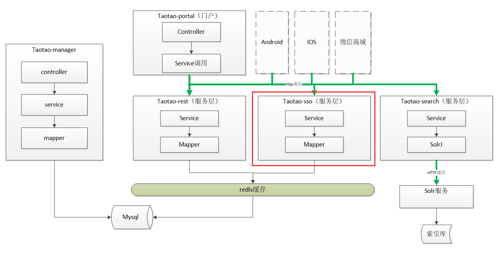

# 单点登录   

Z：session共享可以处理tomcat集群时，session不一致，导致重复登录的问题。

D：系统分布式部署的时候，session不能用session共享的方式，怎么做？

Z：将session放在redis中，设置key的生存时间。  

所以我们需要添加一个单点登录的服务，来构造SSO登录框架

  

D：这个系统需要有什么功能？

Z：它要实现以下几个接口   

-  登录接口

- 注册接口


- 查询接口


- 退出登录接口  

D：做注册接口的时候，要对用户注册信息唯一性进行验证，用什么方式进行验证呢？

Z：通过将用户注册信息传到数据库进行匹配，参数缺陷、已有参数不让注册

Controller

```java
	public TaotaoResult checkData(String content, Integer type) {
		//创建查询条件
		TbUserExample example = new TbUserExample();
		Criteria criteria = example.createCriteria();
		//数据进行校验  1、2、3分别代表username、phone、email
		//用户名校验
		if(1 == type){
			criteria.andUsernameEqualTo(content);
		}else if(2 == type){
			criteria.andPhoneEqualTo(content);
		}else{
			criteria.andEmailEqualTo(content);
		}
		//执行查询
		List<TbUser> list = userMapper.selectByExample(example);
		if(list == null || list.size() == 0){
			return TaotaoResult.ok(true);
		}
		return TaotaoResult.ok(false);
	}
```

Service：通过manager-mapper项目对数据库进行访问

```java
	@Autowired
	private TbUserMapper userMapper;   //从manager-mapper注入过来
	
	public TaotaoResult checkData(String content, Integer type) {
		//创建查询条件
		TbUserExample example = new TbUserExample();
		Criteria criteria = example.createCriteria();
		//数据进行校验  1、2、3分别代表username、phone、email
		//用户名校验
		if(1 == type){
			criteria.andUsernameEqualTo(content);
		}else if(2 == type){
			criteria.andPhoneEqualTo(content);
		}else{
			criteria.andEmailEqualTo(content);
		}
		//执行查询
		List<TbUser> list = userMapper.selectByExample(example);
		if(list == null || list.size() == 0){
			return TaotaoResult.ok(true);
		}
		return TaotaoResult.ok(false);
	}
```

提供的接口为:``http://localhost:8084/user/check/11/4``   


M：这些只提供了注册登录功能，单点的特性呢？


  

