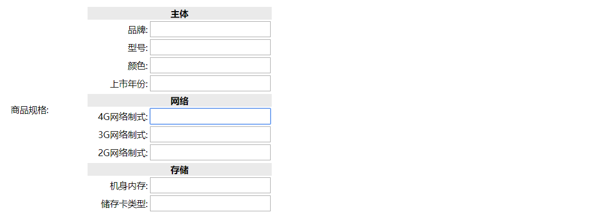
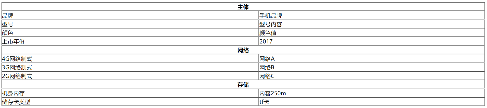

# 数据表存储模板   

应用场景：要将广东省所有学校的所有学院包括其所有专业显示出来。

方案一：通过学校id在学院表里查询对应的学院，拿到学院id后到专业表寻找对应的专业。数据量非常庞大，查询起来很慢。    

方案二：将专业和学院组成一个模板，与学校id对应存储成一个模板库。但对数据的显示js要求比较高。

相似的场景还有商城产品的规格参数：一个产品有多个规格组，每个规格组的规格项也是根据产品不同有所改变。    

本文数据提取用增删改查，直接上代码。而主要介绍方案二：存储模板，读取模板。

## 1.显示规格参数新建   

### 1.前端部分   

前端需要的效果就是：在树节点里面点击类别，如果参数存在，就提示已存在。如果不存在，出现动态添加参数的输入框。整个前端使用easyUI实现。

```html
<table cellpadding="5" style="margin-left: 30px" id="itemParamAddTable" class="itemParam">
	<tr>
		<td>商品类目:</td>
		<td><a href="javascript:void(0)" class="easyui-linkbutton selectItemCat">选择类目</a> 
			<input type="hidden" name="cid" style="width: 280px;"></input>
		</td>
	</tr>
	<tr class="hide addGroupTr">
		<td>规格参数:</td>
		<td>
			<ul>
				<li><a href="javascript:void(0)" class="easyui-linkbutton addGroup">添加分组</a></li>
			</ul>
		</td>
	</tr>
	<tr>
		<td></td>
		<td>
			<a href="javascript:void(0)" class="easyui-linkbutton submit">提交</a>
	    	<a href="javascript:void(0)" class="easyui-linkbutton close">关闭</a>
		</td>
	</tr>
</table>
```

```javascript
		TAOTAO.initItemCat({
			fun:function(node){
				debugger;
				$(".addGroupTr").hide().find(".param").remove();
				//  判断选择的目录是否已经添加过规格
				$.getJSON("/item/param/query/itemcatid/" + node.id,function(data){
					if(data.status == 200 && data.data){
						$.messager.alert("提示", "该类目已经添加，请选择其他类目。", undefined, function(){
							$("#itemParamAddTable .selectItemCat").click();
						});
						return ;
					}
				});
				$(".addGroupTr").show();
			}
		});
```

添加参数列表的准备工作：从Controller判断该类目的参数是否存在，不存在就显示添加分组按钮。

```javascript
		$(".addGroup").click(function(){
			  var temple = $(".itemParamAddTemplate li").eq(0).clone();
			  $(this).parent().parent().append(temple);
			  temple.find(".addParam").click(function(){
				  var li = $(".itemParamAddTemplate li").eq(2).clone();
				  li.find(".delParam").click(function(){
					  $(this).parent().remove();
				  });
				  li.appendTo($(this).parentsUntil("ul").parent());
			  });
			  temple.find(".delParam").click(function(){
				  $(this).parent().remove();
			  });
		 });
```

前端实现不定向新增分组：添加分组按钮点击之后就可以添加分组，分组里面还可以添加参数。

  

## 2.保存新建规格参数

### 1.前端内容   

```javascript
		$("#itemParamAddTable .submit").click(function(){
			var params = [];
			var groups = $("#itemParamAddTable [name=group]");
			groups.each(function(i,e){
				var p = $(e).parentsUntil("ul").parent().find("[name=param]");
				var _ps = [];
				p.each(function(_i,_e){
					var _val = $(_e).siblings("input").val();
					if($.trim(_val).length>0){
						_ps.push(_val);						
					}
				});
				var _val = $(e).siblings("input").val();
				if($.trim(_val).length>0 && _ps.length > 0){
					params.push({
						"group":_val,
						"params":_ps
					});					
				}
			});
			var url = "/item/param/save/"+$("#itemParamAddTable [name=cid]").val();
			$.post(url,{"paramData":JSON.stringify(params)},function(data){
				if(data.status == 200){
					$.messager.alert('提示','新增商品规格成功!',undefined,function(){
						$(".panel-tool-close").click();
    					$("#itemParamList").datagrid("reload");
    				});
				}
			});
		});
```

保存规格参数的方式：遍历每个组，获取一次该组的组名，多次该组的值，将其传到对应的url里。   

1. 传带cid的url：``var url = "/item/param/save/"+$("#itemParamAddTable [name=cid]").val();``  
2. 将json转化为String进行提交：``"paramData":JSON.stringify(params)``      

### 2.Service部分   

```java
TaotaoResult insertItemParam(TbItemParam itemParam);
```

```java
	@Override
	public TaotaoResult insertItemParam(TbItemParam itemParam) {
		//补全pojo
		itemParam.setCreated(new Date());
		itemParam.setUpdated(new Date());
		//插入到规格参数模板表
		itemParamMapper.insert(itemParam);
		return TaotaoResult.ok();
	}
```

存入前先补全其他字段的信息。

### 3.Controller部分   

```java
	@RequestMapping("/save/{cid}")
	@ResponseBody
	public TaotaoResult insertItemParam(@PathVariable Long cid, String paramData){
		//创建pojo对象
		TbItemParam itemParam = new TbItemParam();
		itemParam.setItemCatId(cid);
		itemParam.setParamData(paramData);
		TaotaoResult result = itemParamService.insertItemParam(itemParam);
		return result;
	}
```

插入到数据库的json格式：

```json
[{"group":"分组1","params":["内容a","内容b","内容c"]},{"group":"分组2","params":["内容d"]}]
```

## 3.显示已有规格参数

### 1.Service部分   

```java
	TaotaoResult getItemParamByCid(Long cid);
```

```java
	@Override
	public TaotaoResult getItemParamByCid(Long cid) {
		TbItemParamExample example = new TbItemParamExample();
		Criteria criteria = example.createCriteria();
		criteria.andItemCatIdEqualTo(cid);
		List<TbItemParam> list = itemParamMapper.selectByExampleWithBLOBs(example);
		//判断有没结果
		if(list != null && list.size() > 0){
			return TaotaoResult.ok(list.get(0));  //查询到返回ok		
		}
		return null;
	}
```

用``selectByExampleWithBLOBs`` ,而不用``selectByExample``,是因为逆向工程的 ``selectByExample``是查询不到大文本列的。

### 2.Controller部分   

```java
	@RequestMapping("/query/itemcatid/{itemCatId}")
	@ResponseBody
	public TaotaoResult getItemParamByCid(@PathVariable Long itemCatId){
		TaotaoResult result = itemParamService.getItemParamByCid(itemCatId);
		return result;
	}
```

### 3.html部分   

将参数内容提取出来，转化为html显示为填写表格。

```html
    changeItemParam : function(node,formId){
    	$.getJSON("/item/param/query/itemcatid/" + node.id,function(data){
			  if(data.status == 200 && data.data){
				 $("#"+formId+" .params").show();
				 var paramData = JSON.parse(data.data.paramData);
				 var html = "<ul>";
				 for(var i in paramData){
					 var pd = paramData[i];
					 html+="<li><table>";
					 html+="<tr><td colspan=\"2\" class=\"group\">"+pd.group+"</td></tr>";
					 
					 for(var j in pd.params){
						 var ps = pd.params[j];
						 html+="<tr><td class=\"param\"><span>"+ps+"</span>: </td><td><input autocomplete=\"off\" type=\"text\"/></td></tr>";
					 }
					 
					 html+="</li></table>";
				 }
				 html+= "</ul>";
				 $("#"+formId+" .params td").eq(1).html(html);
			  }else{
				 $("#"+formId+" .params").hide();
				 $("#"+formId+" .params td").eq(1).empty();
			  }
		  });
    },
```

如果存在参数列表，就会显示出来：

  

## 4.保存已有规格参数值   

在原有保存参数信息的方法中添加保存参数值的方法，保存到参数值表中。

### 1.html部分  

```javascript
	//提交表单
	function submitForm(){
		//有效性验证
		if(!$('#itemAddForm').form('validate')){
			$.messager.alert('提示','表单还未填写完成!');
			return ;
		}
		//取商品价格，单位为“分”
		$("#itemAddForm [name=price]").val(eval($("#itemAddForm [name=priceView]").val()) * 100);
		//同步文本框中的商品描述
		itemAddEditor.sync();
		//取商品的规格
		var paramJson = [];
		$("#itemAddForm .params li").each(function(i,e){
			var trs = $(e).find("tr");
			var group = trs.eq(0).text();
			var ps = [];
			for(var i = 1;i<trs.length;i++){
				var tr = trs.eq(i);
				ps.push({
					"k" : $.trim(tr.find("td").eq(0).find("span").text()),
					"v" : $.trim(tr.find("input").val())
				});
			}
			paramJson.push({
				"group" : group,
				"params": ps
			});
		});
		//把json对象转换成字符串
		paramJson = JSON.stringify(paramJson);
		$("#itemAddForm [name=itemParams]").val(paramJson);
		//ajax的post方式提交表单
		//$("#itemAddForm").serialize()将表单序列号为key-value形式的字符串
		$.post("/item/save",$("#itemAddForm").serialize(), function(data){
			if(data.status == 200){
				$.messager.alert('提示','新增商品成功!');
			}
		});
	}
```

遍历所有填入的信息，将其放在一个input标签中，然后序列化该标签进行提交。    

### 2.Controller部分   

**createItem方法** 添加``String itemParams``参数的接收。

### 3.Service部分   

```java
	TaotaoResult createItem(TbItem item,String desc, String itemParam) throws Exception;
```

添加一个参数，用来接收参数列表的值。

在保存参数的时候，调用以下方法来保存参数值：

```java
public TaotaoResult createItem(TbItem item,String desc,String itemParam) throws Exception{
...		
		//添加规格参数
		result = insertItemParamItem(itemId, itemParam);
		if(result.getStatus() != 200){
			throw new Exception();
		}
...
```

```java
	/**
	 * 添加规格参数  
	 * @param itemId
	 * @param itemParam
	 * @return
	 */
	private TaotaoResult insertItemParamItem(Long itemId, String itemParam){
		//创建pojo
		TbItemParamItem itemParamItem = new TbItemParamItem();
		itemParamItem.setItemId(itemId);
		itemParamItem.setParamData(itemParam);
		itemParamItem.setCreated(new Date());
		itemParamItem.setUpdated(new Date());
		//向表中插入数据   
		tbItemParamItemMapper.insert(itemParamItem);
		return TaotaoResult.ok();
	}
```

## 5.前台展示规格参数   

根据存储的json结构，将其转化为一个个值，放入html中。

### 1.Service部分      

```java
public interface ItemParamItemService {
	String getParamItemByItemId(Long itemId);
}
```

```java
@Service
public class ItemParamItemServiceImpl implements ItemParamItemService {
	
	@Autowired
	private TbItemParamItemMapper itemParamItemMapper;
	
	@Override
	public String getParamItemByItemId(Long itemId) {
		
		TbItemParamItemExample example = new TbItemParamItemExample();
		Criteria criteria = example.createCriteria();
		criteria.andItemIdEqualTo(itemId);
		List<TbItemParamItem> list = itemParamItemMapper.selectByExampleWithBLOBs(example);
		if (null == list || list.isEmpty()) {
			return "";
		}
		//取出参数信息
		TbItemParamItem itemParamItem = list.get(0);
		String paramData = itemParamItem.getParamData();
		//把json数据转换成java对象
		List<Map> paramList = JsonUtils.jsonToList(paramData, Map.class);
		//将参数信息转换成html
		StringBuffer sb = new StringBuffer(); 
		sb.append("<table cellpadding=\"0\" cellspacing=\"1\" width=\"100%\" border=\"1\" class=\"Ptable\">\n");
		sb.append("    <tbody>\n");
		for (Map map : paramList) {
			sb.append("        <tr>\n");
			sb.append("            <th class=\"tdTitle\" colspan=\"2\">"+map.get("group")+"</th>\n");
			sb.append("        </tr>\n");
			List<Map> params = (List<Map>) map.get("params");
			for (Map map2 : params) {
				sb.append("        <tr>\n");
				sb.append("            <td class=\"tdTitle\">"+map2.get("k")+"</td>\n");
				sb.append("            <td>"+map2.get("v")+"</td>\n");
				sb.append("        </tr>\n");
			}
		}
		sb.append("    </tbody>\n");
		sb.append("</table>");
		return sb.toString();
	}

}
```

根据id查询相关的参数信息，转化为java对象，循环转化为前端代码，传到前端待显示。

### 2.Controller部分

```java
	@RequestMapping("/items/param/item/{itemId}")
	public String getItemParamItemById(@PathVariable Long itemId, Model model) {
		String itemParamItem = itemParamItemService.getParamItemByItemId(itemId);
		model.addAttribute("param1", itemParamItem);
		//return "item-param-show";
		return "item";
	}
```

前端的显示效果：

   

