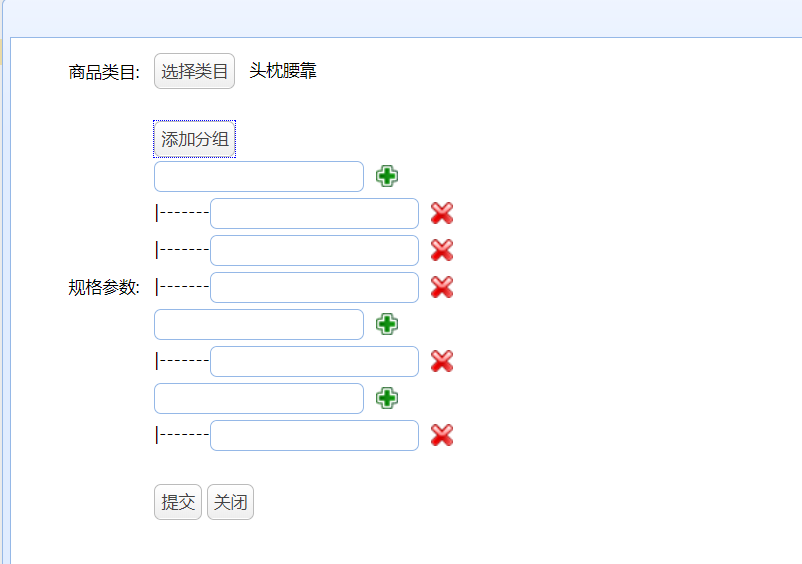

# 数据表存储模板   

应用场景：要将广东省所有学校的所有学院包括其所有专业显示出来。

方案一：通过学校id在学院表里查询对应的学院，拿到学院id后到专业表寻找对应的专业。数据量非常庞大，查询起来很慢。    

方案二：将专业和学院组成一个模板，与学校id对应存储成一个模板库。但对数据的显示js要求比较高。

相似的场景还有商城产品的规格参数：一个产品有多个规格组，每个规格组的规格项也是根据产品不同有所改变。    

本文主要将方案二：存储模板。

## 1.校验是否已有参数   

### 1.前端部分   

前端需要的效果就是：在树节点里面点击类别，如果参数存在，就提示已存在。如果不存在，出现动态添加参数的输入框。整个前端使用easyUI实现。

```html
<table cellpadding="5" style="margin-left: 30px" id="itemParamAddTable" class="itemParam">
	<tr>
		<td>商品类目:</td>
		<td><a href="javascript:void(0)" class="easyui-linkbutton selectItemCat">选择类目</a> 
			<input type="hidden" name="cid" style="width: 280px;"></input>
		</td>
	</tr>
	<tr class="hide addGroupTr">
		<td>规格参数:</td>
		<td>
			<ul>
				<li><a href="javascript:void(0)" class="easyui-linkbutton addGroup">添加分组</a></li>
			</ul>
		</td>
	</tr>
	<tr>
		<td></td>
		<td>
			<a href="javascript:void(0)" class="easyui-linkbutton submit">提交</a>
	    	<a href="javascript:void(0)" class="easyui-linkbutton close">关闭</a>
		</td>
	</tr>
</table>
```

```javascript
		TAOTAO.initItemCat({
			fun:function(node){
				debugger;
				$(".addGroupTr").hide().find(".param").remove();
				//  判断选择的目录是否已经添加过规格
				$.getJSON("/item/param/query/itemcatid/" + node.id,function(data){
					if(data.status == 200 && data.data){
						$.messager.alert("提示", "该类目已经添加，请选择其他类目。", undefined, function(){
							$("#itemParamAddTable .selectItemCat").click();
						});
						return ;
					}
				});
				$(".addGroupTr").show();
			}
		});
```

从Controller判断该类目的参数是否存在，不存在就显示添加分组按钮。

```javascript
		$(".addGroup").click(function(){
			  var temple = $(".itemParamAddTemplate li").eq(0).clone();
			  $(this).parent().parent().append(temple);
			  temple.find(".addParam").click(function(){
				  var li = $(".itemParamAddTemplate li").eq(2).clone();
				  li.find(".delParam").click(function(){
					  $(this).parent().remove();
				  });
				  li.appendTo($(this).parentsUntil("ul").parent());
			  });
			  temple.find(".delParam").click(function(){
				  $(this).parent().remove();
			  });
		 });
```

添加分组按钮点击之后就可以添加分组，分组里面还可以添加参数。

  

## 2.添加模板

### 1.前端内容   

```javascript
		$("#itemParamAddTable .submit").click(function(){
			var params = [];
			var groups = $("#itemParamAddTable [name=group]");
			groups.each(function(i,e){
				var p = $(e).parentsUntil("ul").parent().find("[name=param]");
				var _ps = [];
				p.each(function(_i,_e){
					var _val = $(_e).siblings("input").val();
					if($.trim(_val).length>0){
						_ps.push(_val);						
					}
				});
				var _val = $(e).siblings("input").val();
				if($.trim(_val).length>0 && _ps.length > 0){
					params.push({
						"group":_val,
						"params":_ps
					});					
				}
			});
			var url = "/item/param/save/"+$("#itemParamAddTable [name=cid]").val();
			$.post(url,{"paramData":JSON.stringify(params)},function(data){
				if(data.status == 200){
					$.messager.alert('提示','新增商品规格成功!',undefined,function(){
						$(".panel-tool-close").click();
    					$("#itemParamList").datagrid("reload");
    				});
				}
			});
		});
```

遍历每个组，获取一次该组的组名，多次该组的值，将其传到对应的url里。   

1. 传带cid的url：``var url = "/item/param/save/"+$("#itemParamAddTable [name=cid]").val();``  
2. 将json转化为String进行提交：``"paramData":JSON.stringify(params)``      

### 2.Service部分   

```java
TaotaoResult insertItemParam(TbItemParam itemParam);
```

```java
	@Override
	public TaotaoResult insertItemParam(TbItemParam itemParam) {
		//补全pojo
		itemParam.setCreated(new Date());
		itemParam.setUpdated(new Date());
		//插入到规格参数模板表
		itemParamMapper.insert(itemParam);
		return TaotaoResult.ok();
	}
```

存入前先补全其他字段的信息。

### 3.Controller部分   

```java
	@RequestMapping("/save/{cid}")
	@ResponseBody
	public TaotaoResult insertItemParam(@PathVariable Long cid, String paramData){
		//创建pojo对象
		TbItemParam itemParam = new TbItemParam();
		itemParam.setItemCatId(cid);
		itemParam.setParamData(paramData);
		TaotaoResult result = itemParamService.insertItemParam(itemParam);
		return result;
	}
```

插入到数据库的json格式：

```json
[{"group":"分组1","params":["内容a","内容b","内容c"]},{"group":"分组2","params":["内容d"]}]
```


​   

实现，记录，feiman内容，发文

简单的部分快速跑过！


4天10