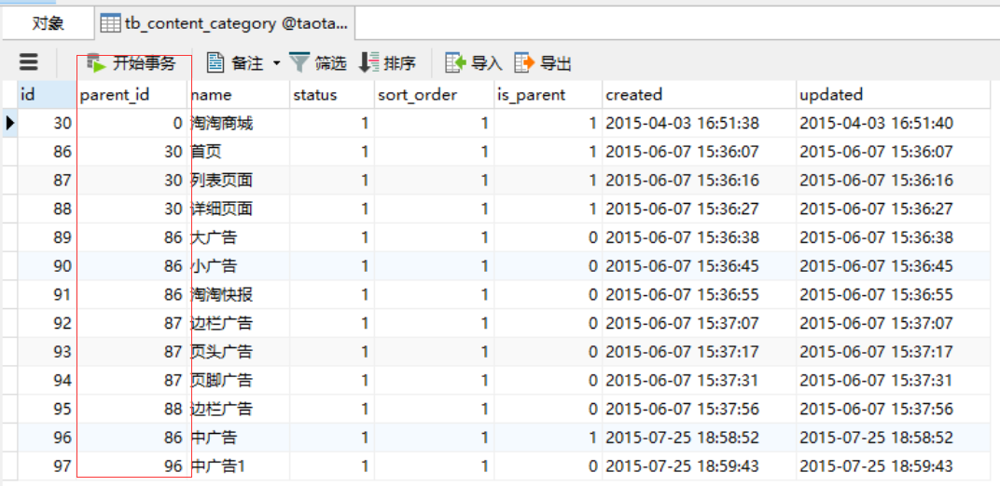
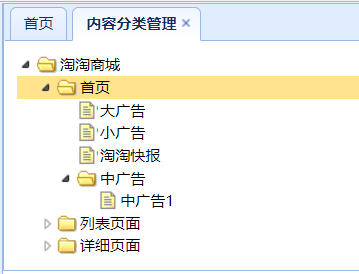
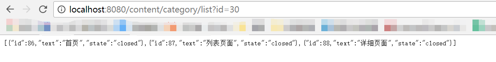

# CMS系统   

D:

```java
	public List<EUTreeNode> getCategoryList(long parentId) {
		//根据parentId查询节点列表
		TbContentCategoryExample example = new TbContentCategoryExample();
		Criteria criteria = example.createCriteria();
		criteria.andParentIdEqualTo(parentId);
		//执行查询
		List<TbContentCategory> list = contentCategoryMapper.selectByExample(example);
		List<EUTreeNode> resultList = new ArrayList<>();
		for (TbContentCategory tbContentCategory : list) {
			//创建节点
			EUTreeNode node = new EUTreeNode();
			node.setId(tbContentCategory.getId());
			node.setText(tbContentCategory.getName());
			node.setState(tbContentCategory.getIsParent()?"closed":"open");
			
			resultList.add(node);
		}
		return resultList;
	}
```

M:``		List<TbContentCategory> list = contentCategoryMapper.selectByExample(example);``查询到的list是什么东西？

Z:Service层



M:也就是说，如果parentId = 30，我可能会查到   首页，列表页面，详细页面   三个模块  。那这三个模块同一个parentId是有什么共同处呢？

D:这需要结合Controller来看：

```java
	@RequestMapping("/list")
	@ResponseBody
	public List<EUTreeNode> getContentCatList(@RequestParam(value="id",defaultValue="0")Long parentId){
		List<EUTreeNode> list = contentCategoryService.getCategoryList(parentId);
		return list;
	}
```

Z:``@RequestParam(value="id",defaultValue="0")Long parentId``  

- 通过@PathVariable，例如/blogs/1
- 通过@RequestParam，例如blogs?blogId=1

当前台传来的与参数列表相同，为parentId，可以不用@RequestParam注解。而RequestParam注解还可以添加默认值。    

M:所以说，它第一次默认为parentId=0，根据数据库可以知道取到 _淘淘商城_ 这个节点，而当点击  _淘淘商城_  时，它的id=30就作为parentId传到Controller，从而获得 _首页_ ，_列表页面_ ，_详细页面_  三个节点，以此类推构成以下动态加载的树状图。

  

M:那它是怎么以json的形式返回前端的呢？

Z:EUTreeNode是专门为了eTree而准备的model，这个model组成一个List，只要配合``@ResponseBody``的使用，就能返回为json数据。

【ResponseBody】一般在异步获取数据时使用，在使用``@RequestMapping``后，返回值通常解析为跳转路径，加上``@Responsebody``后返回结果不会被解析为跳转路径，而是直接写入HTTP response body中。比如异步获取json数据，加上@responsebody后，会直接返回json数据。  

  

D:

```xml

```


首页广告列表获取

节点管理：

​	添加节点实现，插入到数据库

​	删除节点

​	修改节点

内容管理


HttpClient


04  视频做

dzm分析


看一部分，做一部分


dzm分析